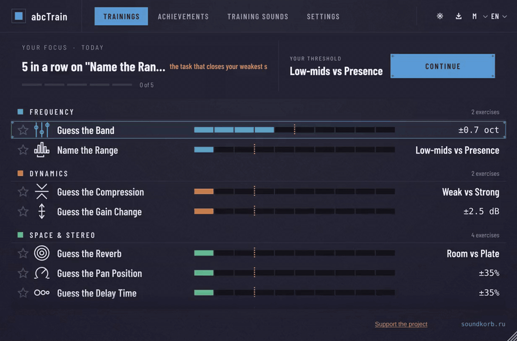

<div align="center">

**English** · [Русский](README.ru.md)

<br>

# abcTrain

### Learn to hear what you have been reading about.

Nine ear-training exercises, and three real effects that explain themselves
while they work on your own audio. Free, source available, macOS · Windows ·
Linux, as VST3 · AU · Standalone.

<br>

[](https://github.com/bogggare567/abcTrain/releases/latest)
&nbsp;
[](https://bogggare567.github.io/abcTrain/)

<br>



<sub>Every frame is drawn by the app itself (<code>tools/EditorSnapshots</code>), so the pictures cannot drift from the code:
the trainer's home and a round, hearing protection, then Learner EQ, Comp (modules, a check, a result) and Verb.<br>
The <a href="https://bogggare567.github.io/abcTrain/">browser demo</a> is the same trainer, playable.</sub>

<br>

[](https://github.com/bogggare567/abcTrain/actions/workflows/build_and_test.yml)
[](https://github.com/bogggare567/abcTrain/actions/workflows/codeql.yml)
[](https://github.com/bogggare567/abcTrain/releases/latest)
[](LICENSE)

[Wiki](https://github.com/bogggare567/abcTrain/wiki) ·
[Discussions](https://github.com/bogggare567/abcTrain/discussions) ·
[Telegram](https://t.me/vstabc) ·
[Roadmap](docs/roadmap.md)

</div>

---

## The nine exercises

Four ask for a **value**, answered by dragging along a scale. Landing inside
the tolerance band counts; the level narrows that band, so harder means
*more precise*, not *quieter*.

| | Exercise | What you are hearing |
|:---:|---|---|
| 🎚️ | Find the frequency | Which frequency got boosted or cut, anywhere in 100 Hz – 12.8 kHz |
| ↔️ | Guess the pan position | Where it sits across the stereo field |
| 🔊 | Guess the gain change | How far the level moved, −9 … +9 dB |
| ⏱️ | Guess the delay time | How long the echo is, 20 – 640 ms |

The other five ask you to **name** a thing, and always give you exactly two
alternatives, at every level. The level changes *which* two: level 1 is a
cathedral against a broom cupboard, level 10 is two things that take work to
separate.

| | Exercise | What you are choosing between |
|:---:|---|---|
| 🥁 | Guess the compression | Two of: weak · medium · strong |
| 🏛️ | Guess the reverb | Two of: room · chamber · hall · plate · spring |
| 🔥 | Guess the distortion | Two of: soft clipping · hard clipping · tape · overdrive |
| 📐 | Guess the stereo width | Two of: narrow · normal · wide · extra wide |
| 🎯 | Name the range | Two of the seven standard ranges: sub-bass … air |

Every answer is a **family, not a preset** — a tiled booth and a big live room
are both rooms.

**Levels measure, not count.** Three right in a row makes the exercise
harder, one wrong makes it easier — the standard psychoacoustic staircase —
so each exercise settles at your real threshold, shown in its own units:
"±0.35 oct", "±1.2 dB", "Room vs Chamber". Your record never drops.

**Practice** is unlimited, **Survival** gives three lives, **Blitz** is ninety
seconds where a wrong answer costs five of them. Train on pink noise, the
built-in clips, or **your own music**.

**Beginner or Pro.** Beginner keeps every rule standard; Pro opens them —
how many right in a row step you up, pauses, lives, the Blitz clock, hints.
**Hearing protection** is on by default and can be switched off: a break
reminder after an hour without ten quiet minutes, a hint when the ear is
tired, and — if you calibrate once with the built-in noise — your weekly
dose against the WHO / ITU-T H.870 limit.

## The three teaching plugins

| | |
|---|---|
| **Learner EQ** | A graphical EQ: up to eight bands of any type — bell, shelf, high-pass, low-pass, notch — added and removed on the curve itself. The spectrum is labelled in *sensations* as well as numbers: Sub, Bass, Boom, Body, Honk, Presence, Sibilance, Air. Four modules: frequency, gain, Q, high-pass. |
| **Learner Comp** | A soft-knee compressor drawn as what it is: a **transfer curve** — level in against level out — computed by the same formula the audio runs through, with a dot riding it at your signal's level. Seven modules, one per control. |
| **Learner Verb** | A reverb whose **Decay is seconds you can measure**: a feedback-delay-network room and hall, a Dattorro plate, two springs. The screen shows the **echogram** — what the room does to one click — with the tail length measured off it. Seven modules. |

<p align="center">


</p>

Each module sets its knob to a value it does **not** show you, plays it, and
you match it by ear **with the plugin's own knob**. Modules climb the same
staircase as the trainer — ten steps, the band in the knob's own units
("±20%", "±1.5 dB", "±0.3 oct") — and each plugin keeps its old lessons as
step-by-step walkthroughs. **A/B** holds two settings one click apart, saved
with your project.

## Known limits

- Builds are **not code-signed** — your system will warn you (see below).
- **Nothing connects anywhere**: no account, no server, no telemetry. Progress
  is a file on your machine.
- **Stems are an estimate, not a trained model.** "Split into stems" divides a
  track into drums, bass, centre and sides from the signal itself
  (harmonic/percussive split, a bass crossover and stereo position): a
  centred synth lands with the vocal, a snare tail can split. Good material
  for training; not a Demucs.
- The in-game feedback sentence after an answer is still English-only;
  everything else — including the plugins, their modules and tooltips — is
  in all twelve languages.
- Of the twelve interface languages, only English and Russian are checked by
  a speaker.

## Getting it

[**Download the latest release**](https://github.com/bogggare567/abcTrain/releases/latest)
— a real installer per platform, built by CI from the commit the tag points at.

**The warning is honest.** These builds are unsigned: a certificate costs
~$99/year (Apple) and $200–500/year (Windows CA) and has not been bought. The
warning says the publisher is unverified, not that anything is wrong with the
file.

- **macOS** — right-click the `.pkg` → **Open** → **Open** again.
- **Windows** — **More info** → **Run anyway**.
- **Linux** — extract and run `./install.sh`.

The [Installation](https://github.com/bogggare567/abcTrain/wiki/Installation)
page walks through all of it, including install paths and where your
progress lives. Or **build from source** — three commands, and it is the
same binary with nothing to click through:

```bash
git clone https://github.com/bogggare567/abcTrain.git
cd abcTrain
cmake -B build && cmake --build build
```

CMake fetches JUCE itself; no separate install needed. On Linux, add
`libcurl4-openssl-dev` first. [Testing and build
detail](docs/testing-strategy.md).

## Languages

English, Русский, Deutsch, Français, Español, Português, Italiano, Polski,
Українська, 简体中文, 日本語, 한국어. Detected on first run, changeable in the
top bar. A correction is one JSON file in `shared/i18n/strings/`.

## Documentation

| | |
|---|---|
| [**Wiki**](https://github.com/bogggare567/abcTrain/wiki) | The manual, for people **using** it — install, first ten minutes, every exercise, your own audio, levels, troubleshooting. Also [in Russian](https://github.com/bogggare567/abcTrain/wiki/ru-Home). |
| [docs/orientation.md](docs/orientation.md) | The map, for people **changing** it. Short. Read it first. |
| [docs/decisions/](docs/decisions/) | Every non-obvious choice, with the alternative that was rejected and why. |
| [docs/user-journey.md](docs/user-journey.md) | What this product is for, and the three questions any proposed feature has to answer. |
| [CLAUDE.md](CLAUDE.md) | Per-file map of the whole repository. |

## Where to ask what

| You have | Go here |
|---|---|
| a question about using it | [Discussions → Q&A](https://github.com/bogggare567/abcTrain/discussions/categories/q-a) |
| something broken | [Issues](https://github.com/bogggare567/abcTrain/issues/new/choose) |
| an idea | [Discussions → Ideas](https://github.com/bogggare567/abcTrain/discussions/categories/ideas) — start with the problem, not the solution |
| something you made with it | [Discussions → Show and tell](https://github.com/bogggare567/abcTrain/discussions/categories/show-and-tell) |
| to hear about new versions | [Telegram → @vstabc](https://t.me/vstabc) |

## Contributing

Good first contributions: a **translation** (one JSON file in
`shared/i18n/strings/`), a **new exercise** (seven steps, in
[docs/orientation.md](docs/orientation.md)), or anything on the
[roadmap](docs/roadmap.md).

One thing nobody tells you: **the tests cannot see layout.** If you change
something visual, render it and look at it.
[.github/CONTRIBUTING.md](.github/CONTRIBUTING.md) covers the rest.

## Licence and rights

**Copyright © 2026 bogggare567 (soundkorb). All rights reserved.**

The source is open to **read**, and to **build for yourself**. It is not
open to redistribute or to commercialise. Without prior written permission
from the copyright holder you may not:

- distribute the software or any build of it, **for a fee or otherwise**;
- use the source, in whole or in part, in a **commercial** product;
- sell, sublicense, rent or resell it.

Using it, on your own machine, on your own music, including work you are
paid for, is fine and always will be. Full text in [LICENSE](LICENSE).

Third-party components — JUCE, and libcurl on Linux builds — stay under
their own licences.

## Supporting it

Free, staying free: no paid tier, nothing locked behind anything. A star helps
other people find it; a donation keeps it moving. Neither unlocks anything.

<div align="center">

[](https://www.donationalerts.com/r/bogdankorablev)
&nbsp;
[](https://t.me/vstabc)

</div>

The rest of this work lives at [soundkorb.ru](https://soundkorb.ru).

<div align="center">
<br>

*ambiance · balance · clarity*

</div>
