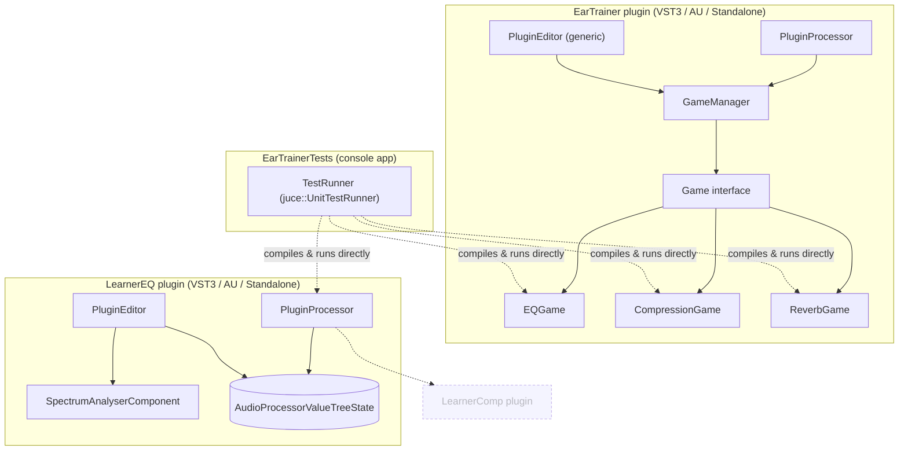

# Ear Trainer / Learner EQ

[](https://github.com/bogggare567/abcTrain/actions/workflows/build_and_test.yml)

Two VST3/AU/Standalone plugins built with [JUCE](https://juce.com):

- **Ear Trainer** — ear-training games. It feeds you pink noise through a
  hidden filter and you guess what changed (which band was boosted/cut,
  how strong the compression is).
- **Learner EQ** — a real 4-band EQ for your own tracks, with a live
  spectrum display, a response-curve overlay, and a one-line plain-
  language explanation of what a frequency region does while you drag it.

Long-term direction is a small learning ecosystem — more trainer games,
more "teaching" plugins in the LearnerEQ shape, an in-plugin knowledge
base — see [docs/roadmap.md](docs/roadmap.md) for what's actually planned
vs. built so far.

## Architecture

Dashed boxes below aren't built yet. Full breakdown, plus class- and
component-level diagrams for each part, in
[docs/diagrams/](docs/diagrams/).



## Building

Requires CMake 3.22+ and a C++17 toolchain (Xcode command line tools on
macOS, MSVC on Windows). JUCE itself is fetched automatically by CMake —
no separate JUCE install needed.

```bash
cmake -B build
cmake --build build --config Release
```

Both plugins build from the one root `CMakeLists.txt`. Artifacts land
under `build/EarTrainer_artefacts/Release/` and
`build/LearnerEQ_artefacts/Release/` (or `Debug/`), each with `VST3/`,
`AU/`, and `Standalone/` subfolders. Copy the `.vst3`/`.component` into
your system plugin folder, or run the Standalone build directly to test
without a DAW.

## Testing

Same build also produces a console `EarTrainerTests` target
(`juce::UnitTestRunner`-based; no plugin host or GUI needed to run it):

```bash
cmake --build build --target EarTrainerTests --config Release
./build/EarTrainerTests_artefacts/Release/EarTrainerTests
```

Exits non-zero if any test fails. Covers the games' scoring/state logic
(`tests/EQGameTest.cpp`, `tests/CompressionGameTest.cpp`,
`tests/ReverbGameTest.cpp`, `tests/GameManagerTest.cpp`) and one real DSP
regression check for LearnerEQ (`tests/LearnerEQTest.cpp` — boosting a
band actually raises measured output level at that frequency). Also runs
on push/PR via `.github/workflows/build_and_test.yml` (badge above).

## Status

**Ear Trainer:** three exercises implemented — "guess the boosted/cut
band" (8 octave bands, 100 Hz–12.8 kHz), "guess the compression strength"
(weak/medium/strong), and "guess the reverb type" (room/hall/plate/
spring) — sharing a common `Game` interface driving one generic UI — see
[docs/architecture.md](docs/architecture.md).

**Learner EQ:** 4-band EQ (low shelf, 2 bells, high shelf) processing real
host audio, host-automatable via `AudioProcessorValueTreeState`, live
spectrum + response curve, contextual tooltip per frequency range while
dragging.

## Documentation

- [docs/architecture.md](docs/architecture.md) — the `Game`/`GameManager`
  design doc and rationale
- [docs/diagrams/](docs/diagrams/) — system overview, game engine class
  diagram, LearnerEQ component diagram, proposed CI pipeline
- [docs/decisions/001-game-interface.md](docs/decisions/001-game-interface.md) —
  why one generic `Game` interface instead of per-game UI
- [docs/testing-strategy.md](docs/testing-strategy.md)
- [docs/roadmap.md](docs/roadmap.md)
- [CLAUDE.md](CLAUDE.md) — full per-file architecture breakdown, kept
  current for anyone (human or Claude) picking this project back up
