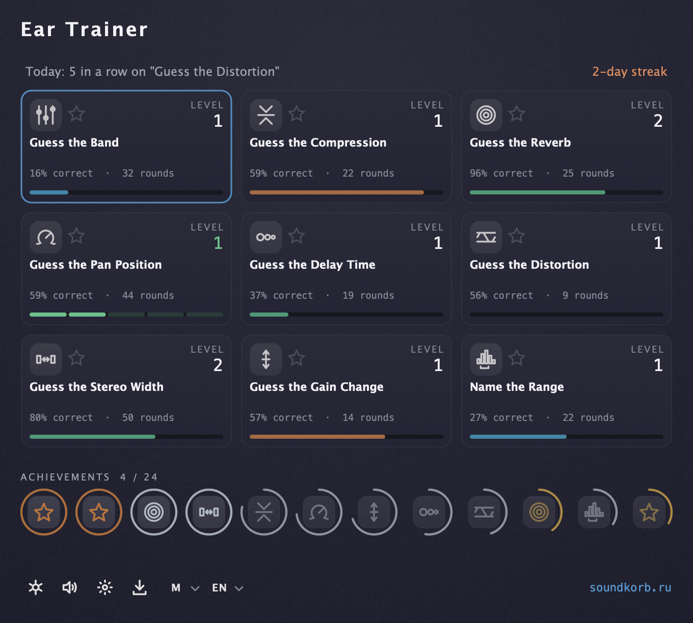
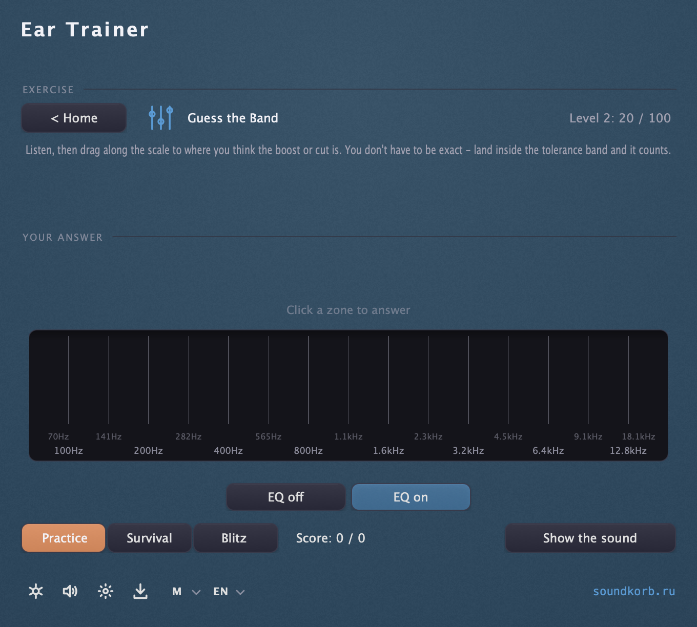
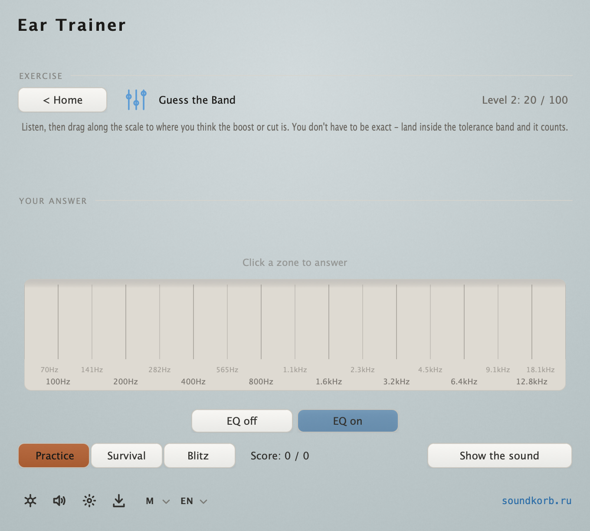
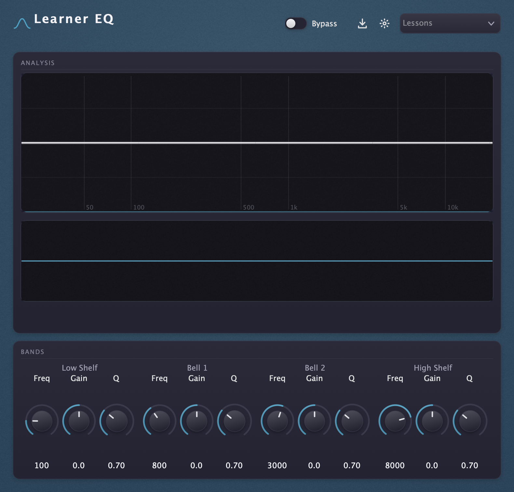
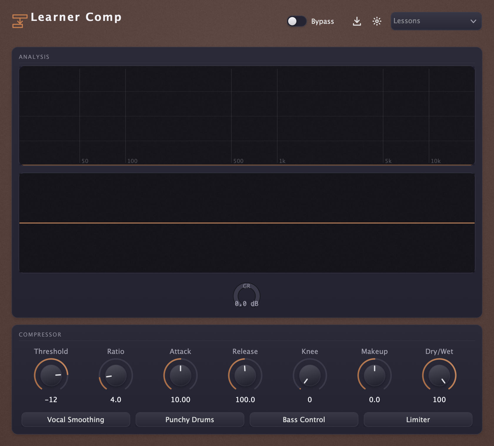
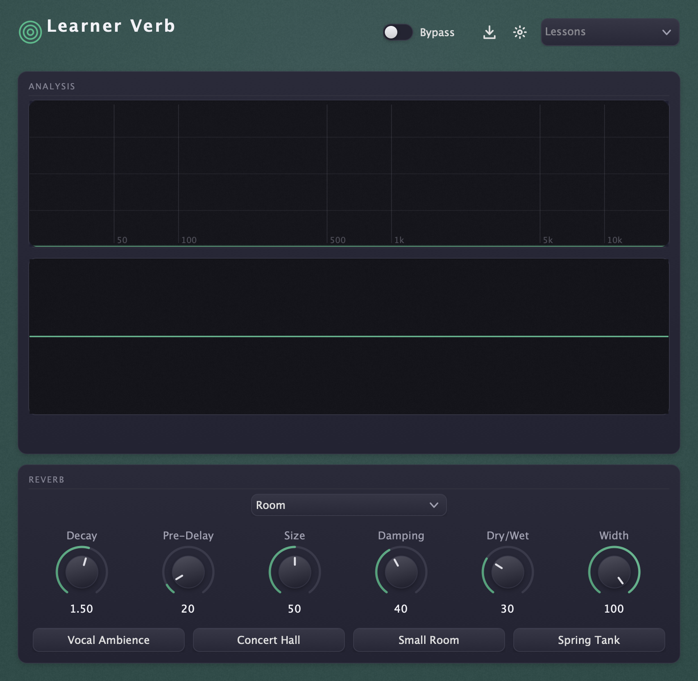
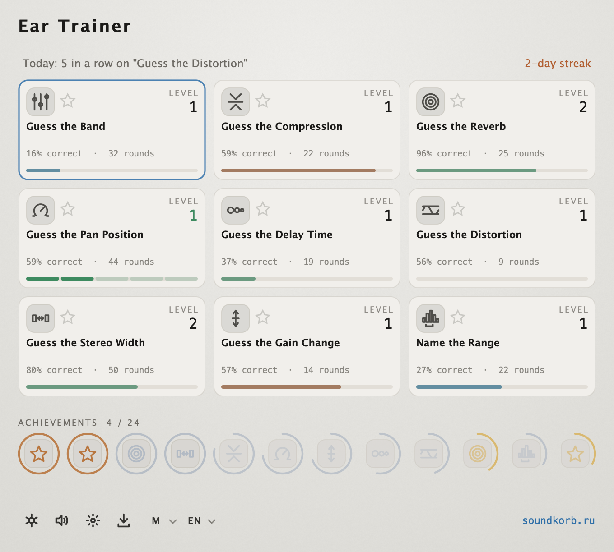

<div align="center">

# abcTrain

**Train your ears. Then use plugins that teach you while you mix.**

Nine ear-training exercises and three real, host-automatable effects —
one free, open-source suite for macOS, Windows and Linux.

[](https://github.com/bogggare567/abcTrain/actions/workflows/build_and_test.yml)
[](https://github.com/bogggare567/abcTrain/releases/latest)
[](#-download)
[](#-supported-languages)
[](docs/testing-strategy.md)

**[⬇ Download](https://github.com/bogggare567/abcTrain/releases/latest)** ·
[Screenshots](#-what-it-looks-like) ·
[How it works](#-how-it-works) ·
[Contribute](docs/orientation.md) ·
[Roadmap](docs/roadmap.md)

<br>



</div>

---

## 📸 What it looks like

Every picture here is the real app, rendered from the real code — see
[`tools/EditorSnapshots.cpp`](tools/EditorSnapshots.cpp), which builds
each editor and photographs it. Nothing is a mockup.

<table>
<tr>
<td width="50%"></td>
<td width="50%"></td>
</tr>
<tr>
<td colspan="2" align="center"><b>Answering.</b> Drag along the scale; a band that narrows as you level up decides whether you were close enough. <b>A/B</b> switches between the untreated sound and the one with the change in it — the only reliable way to hear a difference.</td>
</tr>
<tr>
<td></td>
<td></td>
</tr>
<tr>
<td align="center"><b>Learner EQ</b> — four bands over a live spectrum, with guide text while you turn a knob.</td>
<td align="center"><b>Learner Comp</b> — a gain-reduction meter that fills <i>downward</i>, because that is the direction the sound goes.</td>
</tr>
<tr>
<td></td>
<td></td>
</tr>
<tr>
<td align="center"><b>Learner Verb</b> — five reverb types, each with a preset that says <i>why</i> it is set that way.</td>
<td align="center"><b>A real light theme</b>, designed rather than inverted — warm paper, deeper accents, softer shadows.</td>
</tr>
</table>

---

## The problem

You can read that 300 Hz is "muddy" a hundred times and still not hear it.
Mixing is a listening skill, and listening skills come from repetition
with immediate feedback — not from reading.

Most people never get that repetition, because building the exercise is
harder than doing it.

## 🎧 How it works

**Train.** Nine exercises, each one hiding a change in a sound. You say
what changed. It tells you immediately whether you were right, and by how
much you missed.

**Then apply it.** Three companion plugins process your *own* audio — a
real 4-band EQ, a real compressor, a real reverb — with plain-language
explanations on every control and step-by-step lessons built in. The
thing you just trained on is the thing you're now using.

Nothing is locked. There is no account, no subscription, and no telemetry
— the only network call in the whole suite is the update check, and only
when you press the button.

---

## 🎮 9 games

| | Game | What you're guessing | Answer |
|---|---|---|---|
| 🎚️ | Find the Frequency | Which frequency got boosted or cut, anywhere in 100 Hz–12.8 kHz | scale |
| ↔️ | Guess the Pan Position | Where it sits across the stereo field | scale |
| 🔊 | Guess the Gain Change | How much the level moved, −9…+9 dB | scale |
| ⏱️ | Guess the Delay Time | How long the echo is, 20–640 ms | scale |
| 🥁 | Guess the Compression | How strong the compression is (weak/medium/strong) | choice |
| 🏛️ | Guess the Reverb | Room / Hall / Plate / Spring | choice |
| 🔥 | Guess the Distortion | Soft Clip / Hard Clip / Tape Saturation / Overdrive | choice |
| 📐 | Guess the Stereo Width | Narrow – Normal – Wide – Extra Wide | choice |
| 🎯 | Name the Range | Sub-bass / Bass / Low-mids / Mids / High-mids / Presence / Air | choice |

Every game shares one `Game` interface, one generic UI, adaptive
difficulty (level 1–10), a daily login streak, and a daily challenge — see
[docs/diagrams/game-engine.md](docs/diagrams/game-engine.md).

**Four of them ask for a value, not a choice.** EQ, pan, gain and delay
draw a real target from the whole range each round — 425 Hz, L86, −3.5 dB,
185 ms — and you drag along a scale to answer. Difficulty narrows the
tolerance band rather than making the sound weaker, so harder means *more
precise* instead of *less audible*. The band is in the unit the ear works
in: octaves for frequency, a ratio for delay, dB for gain. See
[decisions/020](docs/decisions/020-continuous-answers.md). The other five
stay multiple-choice, because their answer genuinely is a category
(which reverb, which kind of saturation).

**Runs have a shape.** *Practice* is unlimited. *Survival* gives you three
lives and ends when they're gone. *Blitz* is a 90-second clock where a
wrong answer costs five seconds instead of a life. Rounds advance on their
own after an answer, and every exercise keeps its own lifetime record. See
[decisions/021](docs/decisions/021-sessions-and-navigation.md).

You land on a home screen that groups the trainings by the skill they
build — frequency, dynamics, space & stereo, character — with a star to
pin the ones you're focusing on.

By default every game generates its own pink noise, chosen deliberately
for its flat spectrum (fair for any frequency/width question). A
"Training Sounds" button lets you train on real audio instead: two
always-available built-in categories (five short, originally-synthesized
percussive/sustained samples - no third-party or copyrighted content), or
point it at your own folder of audio via a "Choose Folder..." button.
Categories unlock progressively with your level, same as the games
themselves. This project never fetches, bundles, or vets the legality of
audio in a folder you point it at - that's on you. See
[decisions/015](docs/decisions/015-choice-slider-and-training-sounds.md)
and [decisions/018](docs/decisions/018-ui-polish-and-builtin-samples.md).

## 🎛️ Teaching plugins

- **Learner EQ** — a real 4-band EQ (low shelf, 2 bells, high shelf),
  host-automatable, live spectrum + response-curve display, a scrolling
  input/output waveform, a richer plain-language explanation per
  frequency region (practical values + a "Learn more" book pointer) while
  you drag it, a Bypass/A-B toggle, and a step-by-step "Lesson"
  (Vocal EQ Basics).
- **Learner Comp** — a real compressor with a custom soft-knee engine
  (threshold/ratio/attack/release/knee/makeup/dry-wet), live spectrum, a
  scrolling waveform that highlights in red wherever it's actively
  reducing gain, GR/peak meters, a richer explanation per control, 4
  teaching presets (Vocal Smoothing, Punchy Drums, Bass Control, Limiter),
  Bypass/A-B, and a "Lesson" (Vocal Compression).
- **Learner Verb** — a real reverb (Room/Hall/Plate via `dsp::Reverb`,
  Spring via a custom allpass cascade), the same live spectrum/waveform
  view, a richer explanation per control, 4 presets (Vocal Ambience,
  Concert Hall, Small Room, Spring Tank), Bypass/A-B, and a "Lesson"
  (Space for Vocals).

All three share the same visualization shape and Bypass/Lesson placement
— see [decisions/006](docs/decisions/006-unified-visualization.md). All
four plugins have an "Updates" button that checks GitHub for a newer
release on request — see [Download](#-download) below.

Long-term direction is a small learning ecosystem — more games, more
teaching plugins, an in-plugin knowledge base — see
[docs/roadmap.md](docs/roadmap.md). A first step toward that knowledge
base is [docs/knowledge_base.md](docs/knowledge_base.md) — original
reference material (general, widely-taught practice, not derived from any
specific book) covering EQ, compression, reverb, psychoacoustics,
mastering, mixing, room acoustics, digital audio, saturation, stereo, and
delay/modulation, which the three Learner plugins' tooltips are written
from. [docs/library_catalog.md](docs/library_catalog.md) is a companion
bibliography of ~150 audio-engineering books each tooltip's "Learn more"
line points into — deliberately a title/author catalog only, never
extracted or quoted text; see
[decisions/010](docs/decisions/010-book-library-scope.md) for why.

## 🌍 Supported languages

EarTrainer's editor has a language picker covering its core UI (game
names/instructions, level/score/streak labels, buttons) in 12 languages:

🇬🇧 English · 🇷🇺 Русский · 🇩🇪 Deutsch · 🇫🇷 Français · 🇪🇸 Español ·
🇵🇹 Português · 🇨🇳 简体中文 · 🇯🇵 日本語 · 🇰🇷 한국어 · 🇮🇹 Italiano ·
🇵🇱 Polski · 🇺🇦 Українська

Auto-detected from your system language on first run, persisted after
that. **Scope, honestly**: only the core string set above is translated
today - parameter tooltips, lesson steps, and LearnerEQ/Comp/Verb's UI are
still English-only, and only English/Russian have been directly verified
by a native speaker on this project. See
[decisions/011](docs/decisions/011-i18n.md) for the full picture and
[docs/diagrams/i18n-architecture.md](docs/diagrams/i18n-architecture.md)
for how it fits together.

## 🎨 What it looks like

Dark and light themes, both *designed* rather than one inverted into the
other — a warm off-white page with surfaces stepping up toward white, not
a dark UI with the lightness flipped. Every colour, spacing step, corner
radius and animation duration comes from one token layer, so nothing
drifts.

Four UI sizes (S/M/L/XL) scale one logical layout through a transform, so
every size is the same design rather than four sets of hand-tuned numbers.

Controls have weight: buttons lift and settle, knobs bloom under the
pointer, and press eases faster than release — that asymmetry is what
reads as mass. The spectrum is a smoothed gradient-filled curve over a
soft grid; the gain-reduction meter fills *downward*, because reduction
is the one meter where more is lower.

> **Screenshots:** not in the repo yet. Earlier development ran without a
> display; capturing them now needs a screen-recording permission that
> hasn't been granted. [assets/screenshots/README.md](assets/screenshots/README.md)
> lists exactly which shots are wanted if you'd like to contribute them.

## Download

Pre-release, **unsigned** builds only — see [LICENSE](LICENSE) before
distributing anything built from this repo. Unsigned means macOS
Gatekeeper will show an "unidentified developer" block (right-click the
installer → Open, or allow it in System Settings → Privacy & Security)
and Windows SmartScreen will show a "Windows protected your PC" warning
(click "More info" → "Run anyway") — code signing/notarization is real,
separate future work, not done yet.

- **Tagged releases (recommended):** pushing a `vX.Y.Z` tag publishes a
  [GitHub Release](https://github.com/bogggare567/abcTrain/releases) with
  a real installer for each OS:
  - **macOS** — `abcTrain-macOS-X.Y.Z.dmg`. Open it, run the `.pkg`
    inside, and you'll get a real component-selection installer: check
    which of the four plugins you want, and under each, which format(s)
    (VST3/AU/Standalone) with a one-line explanation of what each format
    is for; then choose "install for all users of this Mac" or "just me"
    for the VST3/AU locations (Apple's installer offers this natively).
    A README, the LICENSE, and an "Open Plugins Folder.command" helper
    are on the same DMG.
  - **Windows** — `abcTrain-Windows-X.Y.Z-setup.exe`. Same
    plugin/format checkbox tree, then a folder-location page for the
    Standalone apps (default `Program Files\abcTrain`) and a second,
    separate page just for the VST3 folder (default
    `Common Files\VST3`) — both are plain text fields you can retype to
    anywhere you like. Creates Start Menu shortcuts and a normal
    Add/Remove Programs entry.
  - **Linux** — `abcTrain-Linux-X.Y.Z.tar.gz`. Extract it and run
    `./install.sh` inside: it asks which plugins to install and where
    VST3s should go (`$HOME/.vst3`, `/usr/lib/vst3` via `sudo`, or a path
    you type), same as the other two OSes, just as a terminal prompt
    instead of a GUI wizard.

  See [docs/decisions/008-installers.md](docs/decisions/008-installers.md)
  for exactly what each installer can and can't do (macOS's system
  installer has no free-text custom path, unlike Windows/Linux — a real
  platform limitation, not an oversight).
- **Latest raw build from any push** (no installer, just the built
  plugins): [Actions](https://github.com/bogggare567/abcTrain/actions/workflows/build_and_test.yml) →
  the most recent green run → **Artifacts** at the bottom of the run page
  → download `plugins-ubuntu-latest`/`plugins-macos-latest`/
  `plugins-windows-latest` (each is a zip of that OS's VST3/AU/Standalone
  builds for all four plugins, for manually copying into place).
- **In-plugin update check:** each plugin has an "Updates" button that
  checks GitHub for a newer tagged release and offers to open the release
  page — manual only, no background network calls. See
  [docs/decisions/007-update-checker.md](docs/decisions/007-update-checker.md).

## 🛠 Built to be worked on

This is meant to outlive whoever wrote it. If you want to add an
exercise, fix something, or fork it entirely:

**[📖 docs/orientation.md](docs/orientation.md)** — the map. The four
load-bearing ideas, a table of *where to put a change*, and a seven-step
recipe for adding an exercise. Read it first; it's short.

Beyond that:

| | |
|---|---|
| [docs/README.md](docs/README.md) | Index of everything — diagrams, decisions, reference material |
| [docs/decisions/](docs/decisions/) | **21 ADRs.** Every non-obvious choice with the alternative that was rejected and why, written for someone who wasn't there |
| [CLAUDE.md](CLAUDE.md) | Per-file breakdown of the whole repo |
| [docs/testing-strategy.md](docs/testing-strategy.md) | What's covered, what isn't, and which gaps are deliberate |

Three things that make changes safe here:

- **One generic UI drives all nine exercises.** Adding a tenth needs no
  editor or processor changes — implement `Game`, register it, add a
  test.
- **Every capability is an opt-in hook with an inert default.** Nothing
  you don't override can break.
- **172 test groups** run on every push across macOS, Windows and Linux.
  Pure logic is tested directly; the deliberate gaps are documented
  rather than pretended away.

And one thing that will bite you if nobody says it: **the tests cannot
see layout.** Every UI pass in this project's history has shipped a bug
that compiled, passed everything, and was obvious ten seconds after
launching the app. If you change something visual, build it and look at
it.

## Building

Requires CMake 3.22+ and a C++17 toolchain (Xcode command line tools on
macOS, MSVC on Windows). JUCE itself is fetched automatically by CMake —
no separate JUCE install needed.

```bash
cmake -B build
cmake --build build --config Release
```

All four plugins build from the one root `CMakeLists.txt`. Artifacts land
under `build/EarTrainer_artefacts/Release/`,
`build/LearnerEQ_artefacts/Release/`,
`build/LearnerComp_artefacts/Release/`, and
`build/LearnerVerb_artefacts/Release/` (or `Debug/`), each with `VST3/`,
`AU/`, and `Standalone/` subfolders. Copy the `.vst3`/`.component` into
your system plugin folder, or run the Standalone build directly to test
without a DAW.

On Linux, building locally also needs `libcurl4-openssl-dev` (or your
distro's equivalent) installed — the in-plugin update checker needs
libcurl for HTTPS there, since JUCE's non-curl Linux networking has no
TLS support at all. See
[docs/decisions/007-update-checker.md](docs/decisions/007-update-checker.md).

## Testing

```bash
cmake --build build --target EarTrainerTests --config Release
./build/EarTrainerTests_artefacts/Release/EarTrainerTests
```

A console app, not a plugin — no host, no GUI. Exits non-zero on any
failure, and runs on every push/PR across all three OSes.

**172 test groups** covering: every game's scoring and state machine; the
shared contract for all four continuous-scale games (on-target passes, a
whole axis away fails, tolerance narrows with difficulty, the axis is
linear in the unit it claims); training-run rules including every hint
pricing boundary; progress/level/streak/daily-challenge maths and its
persistence round-trip; the reference-audio library; lesson step
navigation; version comparison and release-JSON parsing; all twelve
translations; and real DSP assertions for each Learner plugin — an EQ
boost measurably raises output at that frequency, the compressor hits its
closed-form target, reverb leaves a tail and `dryWet=0` is bit-exact.

What *isn't* tested, and why, is written down in
[docs/testing-strategy.md](docs/testing-strategy.md) rather than left for
you to discover.

## Status

**Ear Trainer:** 9 exercises implemented — "guess the boosted/cut band"
(8 octave bands, 100 Hz–12.8 kHz), "guess the compression strength"
(weak/medium/strong), "guess the reverb type" (room/hall/plate/spring),
"guess the pan position" (5 positions, Hard Left–Hard Right), "guess the
delay time" (50/150/300/500 ms), "guess the distortion" (Soft Clip/Hard
Clip/Tape Saturation/Overdrive), "guess the stereo width" (Narrow–Extra
Wide), "guess the gain change" (±dB, the one game whose choice labels
themselves change with difficulty), and "name the frequency range"
(Sub-bass through Air, the standard 7-range naming) — sharing a common `Game` interface
driving one generic UI, plus a `ProgressManager` (points, level 1-10 that
scales each game's difficulty, daily login streak, one daily challenge)
— see [docs/architecture.md](docs/architecture.md),
[docs/diagrams/game-engine.md](docs/diagrams/game-engine.md), and
[docs/decisions/002-difficulty-scaling.md](docs/decisions/002-difficulty-scaling.md).

**Learner EQ:** 4-band EQ (low shelf, 2 bells, high shelf) processing real
host audio, host-automatable via `AudioProcessorValueTreeState`, live
spectrum + response curve, a scrolling input/output waveform, contextual
tooltip per frequency range while dragging, and a Bypass toggle.

**Learner Comp:** compressor with a custom soft-knee gain-computer engine
(threshold/ratio/attack/release/knee/makeup/dry-wet, plus bypass),
processing real host audio, host-automatable, live spectrum, scrolling
waveform with gain-reduction highlighting, GR/peak meters, contextual
tooltip per control, 4 teaching presets — see
[docs/decisions/003-learnercomp-engine.md](docs/decisions/003-learnercomp-engine.md)
for why it isn't built on `juce::dsp::Compressor`.

**Learner Verb:** reverb with Room/Hall/Plate (`juce::dsp::Reverb`) and
Spring (custom allpass cascade) via one `ReverbEngine`, pre-delay,
processing real host audio, host-automatable, the same live spectrum +
scrolling waveform + peak-meter view as LearnerComp (now
`shared/SpectrumAnalyzer`/`shared/WaveformDisplay`), 4 teaching presets, a
Bypass toggle — see
[docs/decisions/004-learnerverb-scope.md](docs/decisions/004-learnerverb-scope.md)
for what was deliberately trimmed from the initial build (impulse-response
visualization, decay-vs-frequency graph, stereo correlometer) and why.

**Micro-lessons:** each Learner plugin has one guided "Lesson" — a
step-by-step walkthrough that jumps its own parameters to a taught value
at each step (Learner EQ: Vocal EQ Basics; Learner Comp: Vocal
Compression; Learner Verb: Space for Vocals) via shared
`MicroLesson`/`LessonController` machinery — see
[docs/decisions/005-microlesson-architecture.md](docs/decisions/005-microlesson-architecture.md)
for the split and what was trimmed (per-control highlighting).

**Unified visualization:** all three Learner plugins now share the same
shape (live spectrum, then waveform + peak meters, then controls, then
Bypass next to Lesson in the title row) via the newly-extracted
`shared/SpectrumAnalyzer` — see
[docs/decisions/006-unified-visualization.md](docs/decisions/006-unified-visualization.md).

## 📚 Documentation

All of it is indexed in **[docs/README.md](docs/README.md)** — one list,
kept in one place, so it can't drift out of step with a second copy here.
(An earlier version of this README *was* that second copy, and it went
stale: it stopped at ADR 012 while the repo had 21.)

The short version: start at [docs/orientation.md](docs/orientation.md),
reach for [docs/decisions/](docs/decisions/) when you want to know why
something is the way it is, and [CLAUDE.md](CLAUDE.md) when you need the
per-file map.

## 🧪 Beta testing

Trying it before it's finished is genuinely useful — see
[BETA_TESTING.md](BETA_TESTING.md) for what's worth testing right now,
and what's already known to be incomplete (so you don't file a bug for
something already tracked).

## 🤝 Contributing

Good first contributions, roughly in order of how self-contained they are:

- **A translation.** One JSON file in `shared/i18n/strings/`. Nine of the
  twelve languages have only been machine-checked.
- **Screenshots.** [assets/screenshots/README.md](assets/screenshots/README.md)
  lists which ones are wanted.
- **A new exercise.** Seven steps, all in
  [docs/orientation.md](docs/orientation.md).
- **Anything on the [roadmap](docs/roadmap.md)** marked ⏳.

[.github/CONTRIBUTING.md](.github/CONTRIBUTING.md) (English + Русский)
covers how PRs are shaped here, and there are
[bug report](.github/ISSUE_TEMPLATE/bug_report.md) and
[feature request](.github/ISSUE_TEMPLATE/feature_request.md) templates.

## 💛 Supporting it

Free, open source, and staying that way — no paid tier, no subscription,
nothing locked behind anything.

If it's useful to you, a **[star](https://github.com/bogggare567/abcTrain)**
helps other people find it, and a donation via
[soundkorb.ru](https://soundkorb.ru) keeps it moving. Both are optional
and neither unlocks anything: gating software behind a star is against
[GitHub's rules on incentivised engagement](https://docs.github.com/en/site-policy/acceptable-use-policies/github-acceptable-use-policies),
and would be trivially bypassable anyway.
