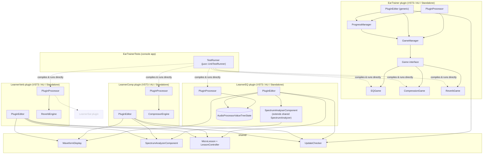

# Ear Trainer / Learner EQ / Learner Comp / Learner Verb

[](https://github.com/bogggare567/abcTrain/actions/workflows/build_and_test.yml)

Four VST3/AU/Standalone plugins built with [JUCE](https://juce.com):

- **Ear Trainer** — ear-training games. It feeds you pink noise through a
  hidden filter and you guess what changed (which band was boosted/cut,
  how strong the compression is, which reverb type). Tracks points, a
  level (1-10, which scales the games' difficulty up as you improve), a
  daily login streak, and a daily challenge.
- **Learner EQ** — a real 4-band EQ for your own tracks, with a live
  spectrum + response-curve display, a scrolling input/output waveform,
  a one-line plain-language explanation of what a frequency region does
  while you drag it, a Bypass/A-B toggle, and a step-by-step "Lesson"
  walkthrough (Vocal EQ Basics).
- **Learner Comp** — a real compressor for your own tracks, with a live
  spectrum, a scrolling input/output waveform that highlights in red
  wherever the compressor is actively reducing gain, a live gain-reduction
  meter, input/output peak meters, a one-line explanation per control, 4
  presets to learn from (Vocal Smoothing, Punchy Drums, Bass Control,
  Limiter), a Bypass/A-B toggle, and a step-by-step "Lesson" walkthrough
  (Vocal Compression).
- **Learner Verb** — a real reverb for your own tracks (Room/Hall/Plate/
  Spring), with the same live spectrum + scrolling waveform/peak-meter
  view, a one-line explanation per control, 4 presets (Vocal Ambience,
  Concert Hall, Small Room, Spring Tank), a Bypass/A-B toggle, and a
  step-by-step "Lesson" walkthrough (Space for Vocals).

All three Learner plugins share the same visualization shape and Bypass/
Lesson button placement now — see
[docs/decisions/006-unified-visualization.md](docs/decisions/006-unified-visualization.md).
All four plugins (EarTrainer included) also have an "Updates" button that
checks GitHub for a newer release on request — see the Download section
below.

Long-term direction is a small learning ecosystem — more trainer games,
more "teaching" plugins in the LearnerEQ shape, an in-plugin knowledge
base — see [docs/roadmap.md](docs/roadmap.md) for what's actually planned
vs. built so far.

## Download

Pre-release builds only — see [LICENSE](LICENSE) before distributing
anything built from this repo.

- **Latest build from any push:** [Actions](https://github.com/bogggare567/abcTrain/actions/workflows/build_and_test.yml) →
  the most recent green run → **Artifacts** at the bottom of the run page
  → download `plugins-ubuntu-latest`/`plugins-macos-latest`/
  `plugins-windows-latest` (each is a zip of that OS's VST3/AU/Standalone
  builds for all four plugins).
- **Tagged releases:** pushing a `vX.Y.Z` tag publishes a
  [GitHub Release](https://github.com/bogggare567/abcTrain/releases) with
  all three OS builds attached.
- **In-plugin update check:** each plugin has an "Updates" button that
  checks GitHub for a newer tagged release and offers to open the release
  page — manual only, no background network calls. See
  [docs/decisions/007-update-checker.md](docs/decisions/007-update-checker.md).

## Architecture

Dashed boxes below aren't built yet. Full breakdown, plus class- and
component-level diagrams for each part, in
[docs/diagrams/](docs/diagrams/).



## Building

Requires CMake 3.22+ and a C++17 toolchain (Xcode command line tools on
macOS, MSVC on Windows). JUCE itself is fetched automatically by CMake —
no separate JUCE install needed.

```bash
cmake -B build
cmake --build build --config Release
```

All four plugins build from the one root `CMakeLists.txt`. Artifacts land
under `build/EarTrainer_artefacts/Release/`,
`build/LearnerEQ_artefacts/Release/`,
`build/LearnerComp_artefacts/Release/`, and
`build/LearnerVerb_artefacts/Release/` (or `Debug/`), each with `VST3/`,
`AU/`, and `Standalone/` subfolders. Copy the `.vst3`/`.component` into
your system plugin folder, or run the Standalone build directly to test
without a DAW.

On Linux, building locally also needs `libcurl4-openssl-dev` (or your
distro's equivalent) installed — the in-plugin update checker needs
libcurl for HTTPS there, since JUCE's non-curl Linux networking has no
TLS support at all. See
[docs/decisions/007-update-checker.md](docs/decisions/007-update-checker.md).

## Testing

Same build also produces a console `EarTrainerTests` target
(`juce::UnitTestRunner`-based; no plugin host or GUI needed to run it):

```bash
cmake --build build --target EarTrainerTests --config Release
./build/EarTrainerTests_artefacts/Release/EarTrainerTests
```

Exits non-zero if any test fails. Covers the games' scoring/state logic
(`tests/EQGameTest.cpp`, `tests/CompressionGameTest.cpp`,
`tests/ReverbGameTest.cpp`, `tests/GameManagerTest.cpp`), progress/level/
streak/daily-challenge logic (`tests/ProgressManagerTest.cpp`), and DSP/
behavioral checks for all three Learner plugins (`tests/LearnerEQTest.cpp`
— boosting a band raises measured output level at that frequency;
`tests/LearnerCompTest.cpp` — closed-form compression/makeup-gain math,
bypass passthrough, preset application; `tests/LearnerVerbTest.cpp` — a
tail persists after the input stops, `dryWet=0` is an exact passthrough,
bypass forces an exact dry passthrough without clobbering `Dry/Wet`, every
reverb type produces sound, preset application), the step-navigation
logic behind the "Lesson" feature (`tests/MicroLessonTest.cpp`), and the
pure version-comparison/JSON-parsing logic behind the "Check for Updates"
button (`tests/UpdateCheckerTest.cpp` — the real network call itself
isn't tested, see
[docs/decisions/007-update-checker.md](docs/decisions/007-update-checker.md)).
Also runs on push/PR via `.github/workflows/build_and_test.yml` (badge
above).

## Status

**Ear Trainer:** three exercises implemented — "guess the boosted/cut
band" (8 octave bands, 100 Hz–12.8 kHz), "guess the compression strength"
(weak/medium/strong), and "guess the reverb type" (room/hall/plate/
spring) — sharing a common `Game` interface driving one generic UI, plus
a `ProgressManager` (points, level 1-10 that scales each game's
difficulty, daily login streak, one daily challenge) — see
[docs/architecture.md](docs/architecture.md) and
[docs/decisions/002-difficulty-scaling.md](docs/decisions/002-difficulty-scaling.md).

**Learner EQ:** 4-band EQ (low shelf, 2 bells, high shelf) processing real
host audio, host-automatable via `AudioProcessorValueTreeState`, live
spectrum + response curve, a scrolling input/output waveform, contextual
tooltip per frequency range while dragging, and a Bypass toggle.

**Learner Comp:** compressor with a custom soft-knee gain-computer engine
(threshold/ratio/attack/release/knee/makeup/dry-wet, plus bypass),
processing real host audio, host-automatable, live spectrum, scrolling
waveform with gain-reduction highlighting, GR/peak meters, contextual
tooltip per control, 4 teaching presets — see
[docs/decisions/003-learnercomp-engine.md](docs/decisions/003-learnercomp-engine.md)
for why it isn't built on `juce::dsp::Compressor`.

**Learner Verb:** reverb with Room/Hall/Plate (`juce::dsp::Reverb`) and
Spring (custom allpass cascade) via one `ReverbEngine`, pre-delay,
processing real host audio, host-automatable, the same live spectrum +
scrolling waveform + peak-meter view as LearnerComp (now
`shared/SpectrumAnalyzer`/`shared/WaveformDisplay`), 4 teaching presets, a
Bypass toggle — see
[docs/decisions/004-learnerverb-scope.md](docs/decisions/004-learnerverb-scope.md)
for what was deliberately trimmed from the initial build (impulse-response
visualization, decay-vs-frequency graph, stereo correlometer) and why.

**Micro-lessons:** each Learner plugin has one guided "Lesson" — a
step-by-step walkthrough that jumps its own parameters to a taught value
at each step (Learner EQ: Vocal EQ Basics; Learner Comp: Vocal
Compression; Learner Verb: Space for Vocals) via shared
`MicroLesson`/`LessonController` machinery — see
[docs/decisions/005-microlesson-architecture.md](docs/decisions/005-microlesson-architecture.md)
for the split and what was trimmed (per-control highlighting).

**Unified visualization:** all three Learner plugins now share the same
shape (live spectrum, then waveform + peak meters, then controls, then
Bypass next to Lesson in the title row) via the newly-extracted
`shared/SpectrumAnalyzer` — see
[docs/decisions/006-unified-visualization.md](docs/decisions/006-unified-visualization.md).

## Documentation

- [docs/architecture.md](docs/architecture.md) — the `Game`/`GameManager`
  design doc and rationale
- [docs/diagrams/](docs/diagrams/) — system overview, game engine class
  diagram, Learner-plugin component diagrams, proposed CI pipeline
- [docs/decisions/001-game-interface.md](docs/decisions/001-game-interface.md) —
  why one generic `Game` interface instead of per-game UI
- [docs/decisions/002-difficulty-scaling.md](docs/decisions/002-difficulty-scaling.md) —
  `setDifficulty`/`ProgressManager`
- [docs/decisions/003-learnercomp-engine.md](docs/decisions/003-learnercomp-engine.md) —
  why LearnerComp has a custom compressor engine
- [docs/decisions/004-learnerverb-scope.md](docs/decisions/004-learnerverb-scope.md) —
  LearnerVerb's trimmed visualization scope and the decay-to-`roomSize` approximation
- [docs/decisions/005-microlesson-architecture.md](docs/decisions/005-microlesson-architecture.md) —
  `MicroLesson`/`LessonController` split and why per-control highlighting was cut
- [docs/decisions/006-unified-visualization.md](docs/decisions/006-unified-visualization.md) —
  unifying spectrum/waveform/bypass across all three Learner plugins, and
  why it isn't tested with a real `SpectrumAnalyzerComponent`
- [docs/decisions/007-update-checker.md](docs/decisions/007-update-checker.md) —
  CI artifacts/releases, the manual-only "Check for Updates" button, and
  why it needs `NEEDS_CURL TRUE` on Linux
- [docs/testing-strategy.md](docs/testing-strategy.md)
- [docs/roadmap.md](docs/roadmap.md)
- [CLAUDE.md](CLAUDE.md) — full per-file architecture breakdown, kept
  current for anyone (human or Claude) picking this project back up
