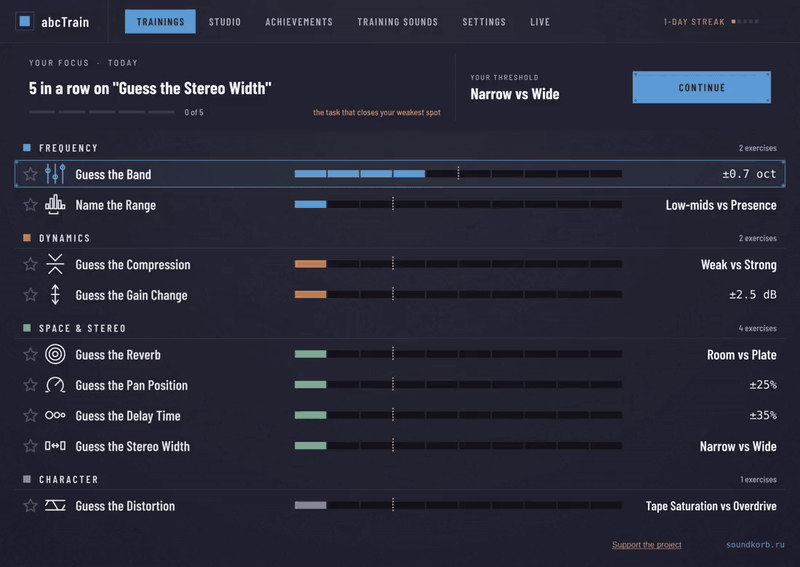
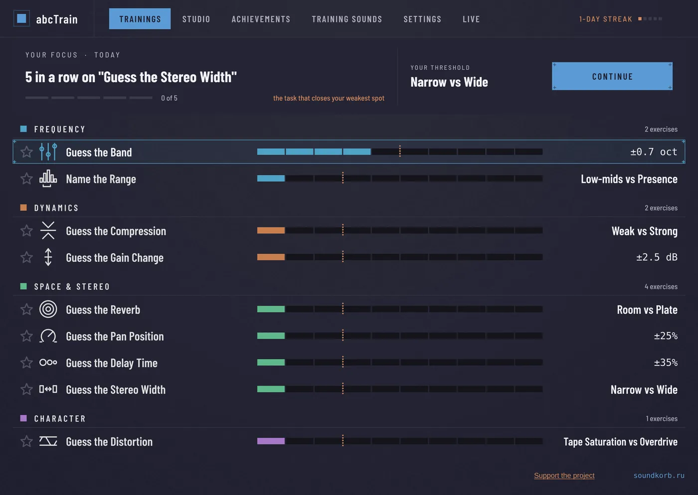
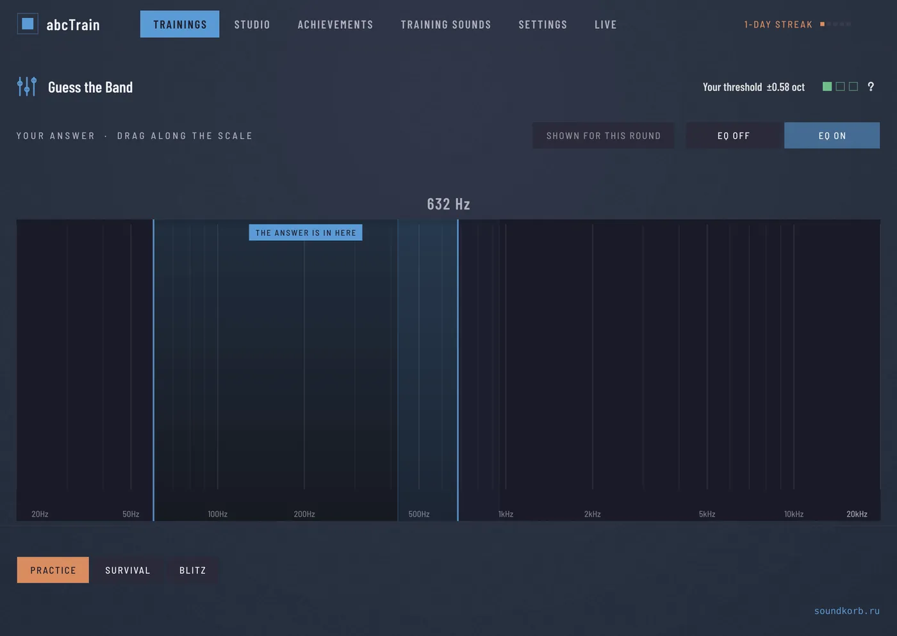
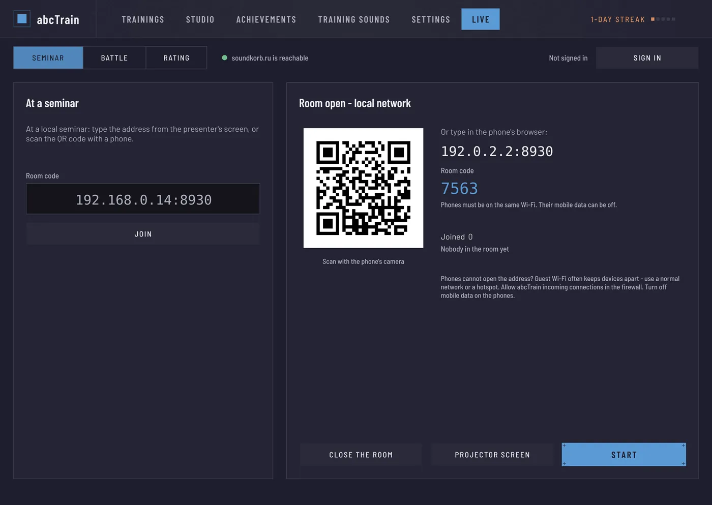
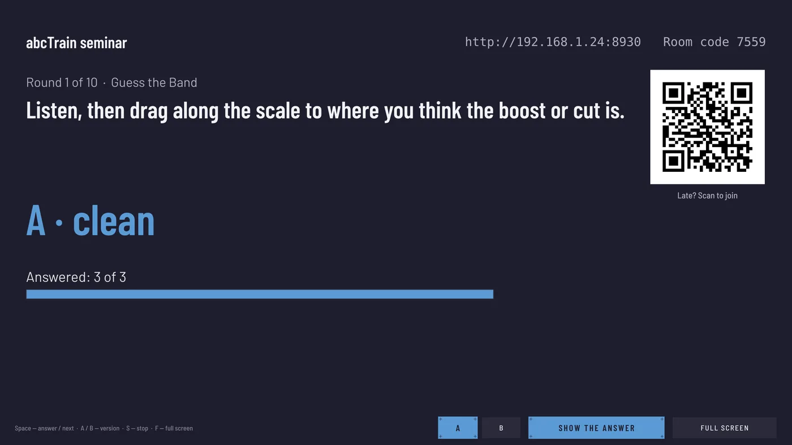
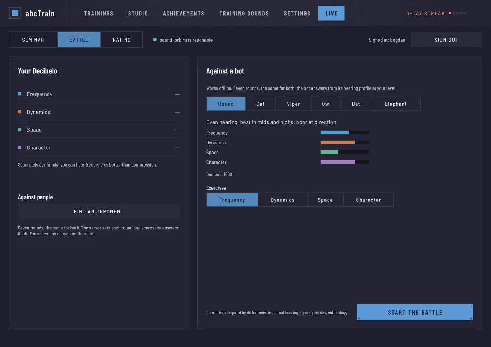
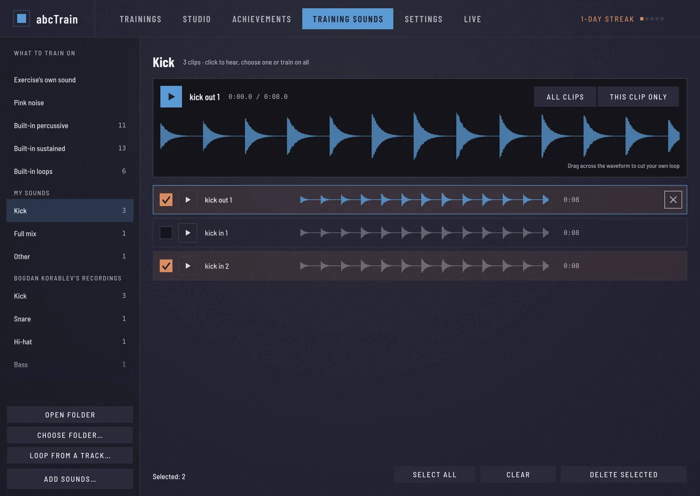
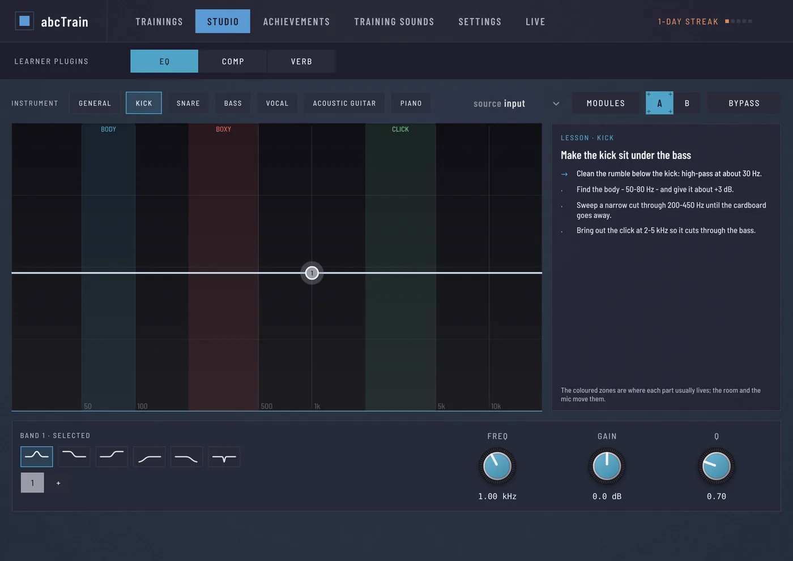
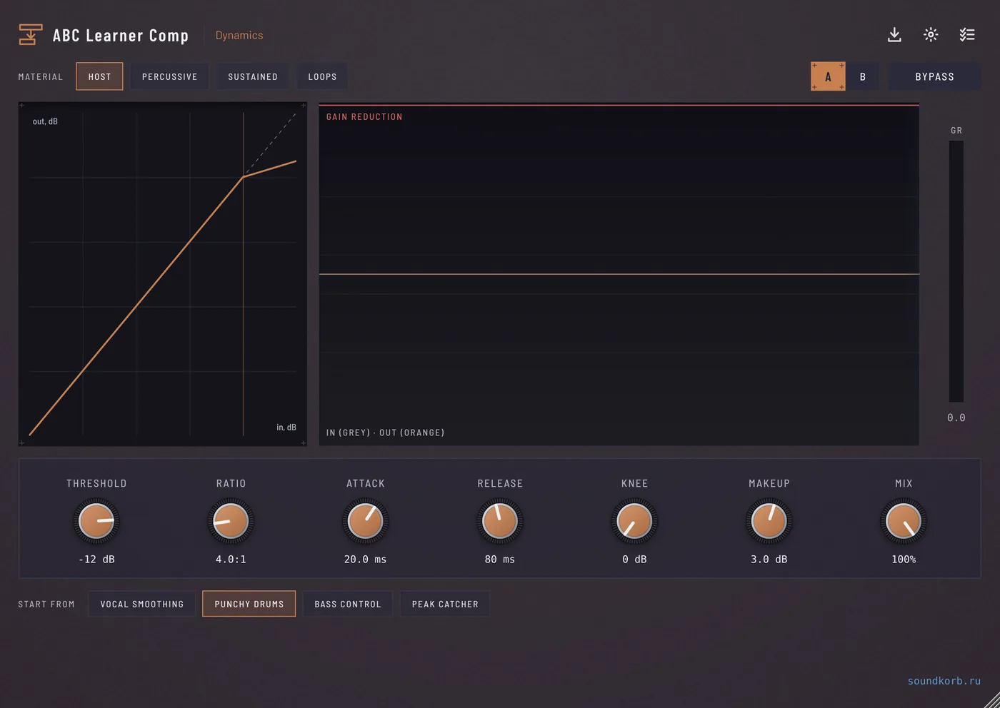

**English** · [Русский](README.ru.md)

 

# abcTrain

### Learn to hear what you have been reading about.

Nine listening exercises and three real effects that teach while they work on your audio. 
Free · macOS · Windows · Linux · the app + VST3 · AU plugins

 

&nbsp;

&nbsp;

 

Every frame is drawn by the app itself, so the pictures cannot drift from the code.

 

| | |
|:---:|---|
| 🎧 | **ABC Ear Trainer** — frequency, dynamics, space, character. A psychoacoustic staircase finds your real threshold and shows it in the exercise's own units: *±0.35 oct*, *±1.2 dB*, *Room vs Chamber*. |
| 🎛️ | **ABC Learner EQ · Comp · Verb** — real processors in your DAW and in the app's Studio tab. Each hides a setting, plays it, and asks you to match it by ear with its own knob. |
| 📚 | **Grounded in research** — how ear training is taught and how the processing is done follow published work. [Why each choice →](docs/research/2026-09-literature-audit.md) |
| 🎤 | **Live** — a seminar in a room with no internet: the laptop plays into the hall, the audience answers on their phones through one QR code, a projector window shows the votes and the answer. Battles for the Decibelo rating against a person over soundkorb.ru, or offline against six bot listeners. An account only if you want one. |
| 🔒 | **Offline by default** — training, the plugins and bot battles never touch a network; no telemetry. Live connects only when you open it. |

**[How to use it →](https://github.com/bogggare567/abcTrain/wiki)** &nbsp;·&nbsp; [Install & the unsigned warning](https://github.com/bogggare567/abcTrain/wiki/Installation) &nbsp;·&nbsp; [The exercises](https://github.com/bogggare567/abcTrain/wiki/The-nine-exercises) &nbsp;·&nbsp; [The plugins](https://github.com/bogggare567/abcTrain/wiki/The-teaching-plugins)

## What it looks like in 2.0

<table>
<tr><td width="50%"> Nine exercises in four families, each with your threshold in its own units</td><td width="50%"> Guess the Band: move along the scale, the hint shows the spectrum</td></tr>
<tr><td width="50%"> A seminar: the room opens on the laptop, phones join by QR</td><td width="50%"> The projector window: the task, the votes, the answer</td></tr>
<tr><td width="50%"> Battles: against a person for Decibelo, or against a bot offline</td><td width="50%"> Your own sounds by instrument; tick several and delete at once</td></tr>
<tr><td width="50%"> Studio: the Learner plugins inside the app</td><td width="50%"> ABC Learner Comp in a DAW</td></tr>
</table>

Rendered by the app itself (tools/EditorSnapshots), so they cannot drift from the code.

## Built in the open

Everything is decided in public: what is planned, why, and what testers found.

| | |
|---|---|
| 🗺️ [**Board**](https://github.com/users/bogggare567/projects/1) | what is being worked on, and what is next |
| 💬 [**Discussions**](https://github.com/bogggare567/abcTrain/discussions) | questions, ideas, what you made with it |
| 🐞 [**Issues**](https://github.com/bogggare567/abcTrain/issues/new/choose) | something broken |
| 📣 [**Telegram**](https://t.me/vstabc) | new versions |

Code, a translation or a sound pack you have the rights to — see [CONTRIBUTING](.github/CONTRIBUTING.md).

## Support it

Free for everyone, with nothing locked. Support pays for what the project cannot do on its own — **code signing** so the installer stops warning, and **licensed music** for the sound library.

&nbsp;

 

The source is open to read and to build for yourself; it is not licensed for redistribution or commercial use — [LICENSE](LICENSE). JUCE and libcurl keep their own licences. By [soundkorb](https://soundkorb.ru).
