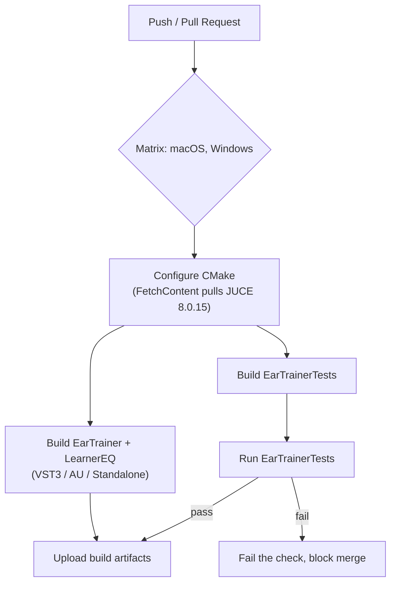

# CI pipeline (proposed — not implemented yet)

No `.github/workflows/` exists in this repo yet. This is the proposed
shape for when it's built (task 0.2 in [../roadmap.md](../roadmap.md)),
not a description of something running today.

Open questions to resolve before implementing this:

- **Which OS runners.** `EarTrainer`/`LearnerEQ` are macOS/Windows plugin
  formats (AU is macOS-only); Linux isn't a target format but could still
  run `EarTrainerTests` cheaply if a fast sanity check on every push is
  wanted before the slower macOS/Windows plugin builds run.
- **JUCE fetch caching.** `FetchContent` re-cloning JUCE on every run is
  slow; cache the `_deps` build directory keyed on the pinned JUCE tag in
  `CMakeLists.txt`.
- **Artifact retention/signing.** Out of scope until there's an actual
  release process (see phase 1.0 in the roadmap) — unsigned CI builds
  aren't distributable as-is on macOS/Windows.
