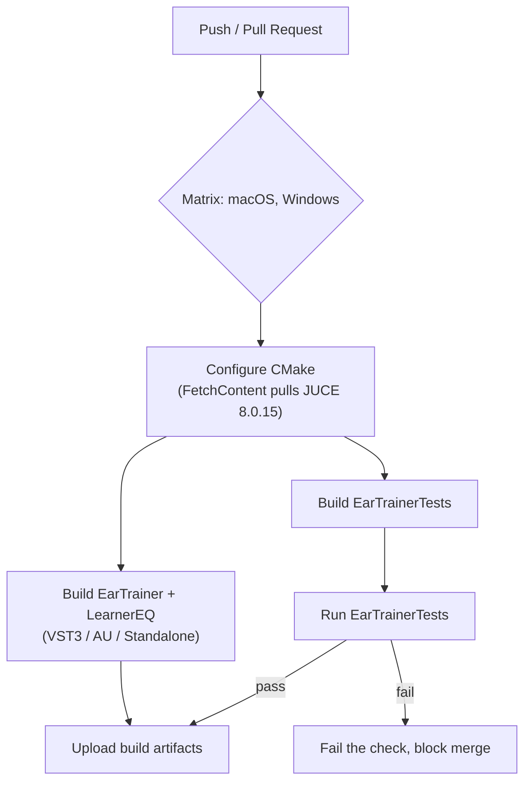

# CI pipeline

`.github/workflows/build_and_test.yml` exists and runs this on every push/
PR. **Confirmed green on all three OSes** as of commit `a2f2944`
(2026-07-24) — Windows, macOS, and Ubuntu all built every target and ran
`EarTrainerTests` to completion successfully. This was not the first
attempt: two real bugs surfaced and got fixed along the way, both worth
knowing about if the build ever regresses:

1. `LearnerEQProcessor::getName()` returned the `JucePlugin_Name` macro,
   which JUCE only defines for real `juce_add_plugin` targets. It's
   undefined for `EarTrainerTests` (a `juce_add_console_app` that compiles
   `LearnerEQ/Source/PluginProcessor.cpp` directly), so every compiler
   failed there with an undeclared-identifier error. Fixed by returning a
   literal string instead.
2. `cmake --build ... --parallel` with no number, on the Unix Makefiles
   generator (the default on Linux/macOS), means unlimited concurrent
   `make` jobs, not "one per core." Building three targets' worth of JUCE
   unity-build translation units at once OOM-killed the Ubuntu runner
   (exit 143). Fixed by capping it explicitly (`--parallel 2`).

Open questions to resolve before implementing this:

- **Which OS runners.** `EarTrainer`/`LearnerEQ` are macOS/Windows plugin
  formats (AU is macOS-only); Linux isn't a target format but could still
  run `EarTrainerTests` cheaply if a fast sanity check on every push is
  wanted before the slower macOS/Windows plugin builds run.
- **JUCE fetch caching.** `FetchContent` re-cloning JUCE on every run is
  slow; cache the `_deps` build directory keyed on the pinned JUCE tag in
  `CMakeLists.txt`.
- **Artifact retention/signing.** Out of scope until there's an actual
  release process (see phase 1.0 in the roadmap) — unsigned CI builds
  aren't distributable as-is on macOS/Windows.
