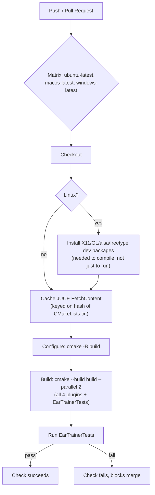

# CI pipeline

`.github/workflows/build_and_test.yml` exists and runs this on every push/
PR. **Confirmed green on all three OSes** as of commit `a2f2944`
(2026-07-24) — Windows, macOS, and Ubuntu all built every target and ran
`EarTrainerTests` to completion successfully — again on `dd207d1`
(LearnerComp), `8932b84` (LearnerVerb), `dd0ef5a` (MicroLesson/
LessonController), and `7accd19` (the visualization-unification fix, see
bug 3 below). Each checked directly against the GitHub Actions API or the
Actions web UI, not assumed. The first green run was not the first
attempt, and it hasn't been the last: three real bugs have surfaced and
gotten fixed along the way, all worth knowing about if the build ever
regresses:

1. `LearnerEQProcessor::getName()` returned the `JucePlugin_Name` macro,
   which JUCE only defines for real `juce_add_plugin` targets. It's
   undefined for `EarTrainerTests` (a `juce_add_console_app` that compiles
   `LearnerEQ/Source/PluginProcessor.cpp` directly), so every compiler
   failed there with an undeclared-identifier error. Fixed by returning a
   literal string instead.
2. `cmake --build ... --parallel` with no number, on the Unix Makefiles
   generator (the default on Linux/macOS), means unlimited concurrent
   `make` jobs, not "one per core." Building three targets' worth of JUCE
   unity-build translation units at once OOM-killed the Ubuntu runner
   (exit 143). Fixed by capping it explicitly (`--parallel 2`).
3. Extracting `shared/SpectrumAnalyzer` (commit `b3c2f88`, see
   [decisions/006](decisions/006-unified-visualization.md)) moved all of
   `SpectrumAnalyserComponent`'s construction logic into the new base
   class and left the derived (LearnerEQ) class with no constructor of its
   own. That's not enough on its own:
   `JUCE_DECLARE_NON_COPYABLE_WITH_LEAK_DETECTOR` declares a deleted copy
   constructor, and per the C++ standard, a class with *any* user-declared
   constructor — deleted or not — gets no implicitly-generated default
   constructor at all. `LearnerEQEditor`'s `SpectrumAnalyserComponent
   spectrum;` member failed to compile identically on all three OSes.
   Fixed in `7accd19` by adding an explicit `SpectrumAnalyserComponent()
   = default;`. This one was reproduced and fixed by actually installing
   `cmake` and building locally (this sandbox has Homebrew + `clang++`
   after all) rather than guessing from a read-through, since GitHub's API
   and web UI both refuse raw Actions logs to an unauthenticated viewer
   even on a public repo.

This is the actual shape of `.github/workflows/build_and_test.yml`, not a
proposal — kept in sync with the real file, not an earlier draft of it:

Deliberately **not** in this pipeline, all still open:

- **No artifact upload.** A green run proves the code builds and passes
  tests; it doesn't produce a downloadable `.vst3`/`.component` for anyone
  to actually try. Add this once there's a reason to hand someone a build
  without them cloning and compiling it themselves.
- **No code signing / notarization.** Out of scope until there's an actual
  release process (see phase 1.0 in `../roadmap.md`) — unsigned builds
  aren't distributable as-is on macOS/Windows regardless.
- **No separate fast/slow split.** Every OS builds all four plugins plus
  the test binary in one job; there's no cheap "just run the tests"
  Linux-only fast-fail step ahead of the (slower) macOS/Windows plugin
  builds. Worth revisiting if CI turnaround time becomes annoying.
