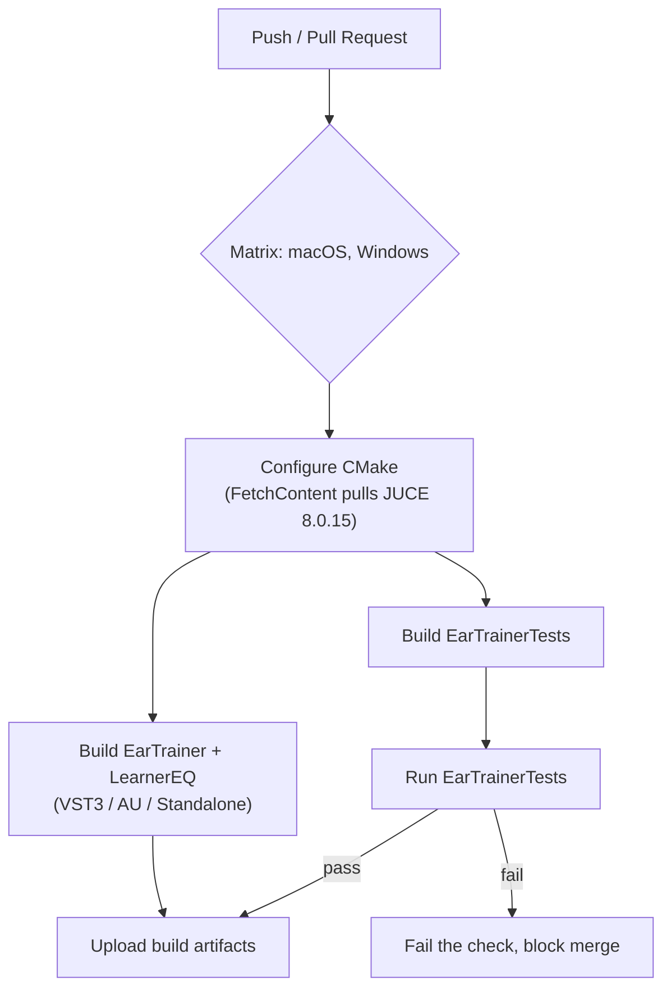

# CI pipeline

`.github/workflows/build_and_test.yml` exists and runs this on every push/
PR. Status as of the first real runs: **Windows confirmed green**.
**Ubuntu OOM-killed** (exit 143) on the first attempt — `--parallel` with
no number, on the Unix Makefiles generator, means unlimited concurrent
`make` jobs, not "one per core"; building three targets' worth of JUCE
unity-build translation units at once exhausted the runner's memory. Fixed
by capping it (`--parallel 2`) — pushed, not yet re-confirmed. **macOS**
status not yet confirmed either way. Don't trust this pipeline as a merge
gate until all three have an observed green run, not just "the workflow
exists."

Open questions to resolve before implementing this:

- **Which OS runners.** `EarTrainer`/`LearnerEQ` are macOS/Windows plugin
  formats (AU is macOS-only); Linux isn't a target format but could still
  run `EarTrainerTests` cheaply if a fast sanity check on every push is
  wanted before the slower macOS/Windows plugin builds run.
- **JUCE fetch caching.** `FetchContent` re-cloning JUCE on every run is
  slow; cache the `_deps` build directory keyed on the pinned JUCE tag in
  `CMakeLists.txt`.
- **Artifact retention/signing.** Out of scope until there's an actual
  release process (see phase 1.0 in the roadmap) — unsigned CI builds
  aren't distributable as-is on macOS/Windows.
