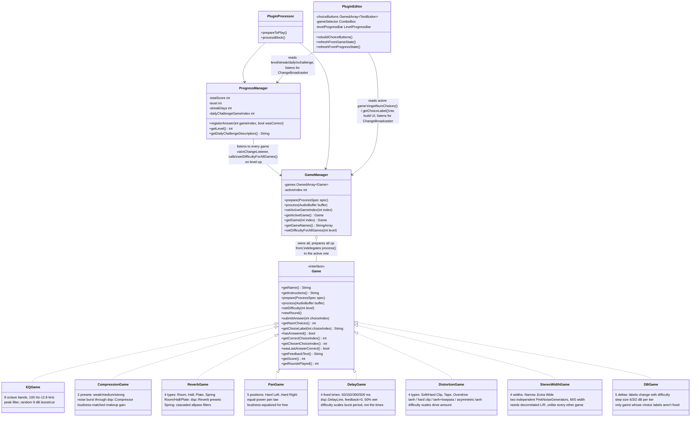

# EarTrainer game engine

Every exercise implements one interface, so `GameManager` and
`PluginEditor` never need per-game special cases. See
[decisions/001-game-interface.md](../decisions/001-game-interface.md) for
why this shape was chosen over a per-game editor, and
[decisions/002-difficulty-scaling.md](../decisions/002-difficulty-scaling.md)
for why `setDifficulty(int)` was added and how `ProgressManager` drives it.

**Why `GameManager` prepares every game up front:** switching the active
game (via the editor's `ComboBox`) then never needs an audio-thread
re-prepare — every registered `Game` is always ready, regardless of which
one is currently selected.

**Why `ProgressManager` calls `registerAnswer` instead of always going
through the `ChangeListener` chain:** `Game::sendChangeMessage()` is
asynchronous (needs a running JUCE message loop to deliver) — fine in the
real plugin, but `EarTrainerTests` never runs one, so
`ProgressManagerTest` drives `registerAnswer` directly instead. See
[testing-strategy.md](../testing-strategy.md).

**How the five newer games' `setDifficulty` differs from
`CompressionGame`'s "same labels, converging values" precedent:**
`PanGame`/`StereoWidthGame` follow that precedent exactly (same
qualitative labels at every tier, underlying values converge toward
"normal" as it gets harder). `DelayGame`/`DistortionGame` keep their
choice set fixed too, but scale a *different* DSP parameter behind the
scenes (burst period, drive amount) rather than the values the labels
describe, since those specific labels (delay times, distortion type
names) were spec'd as literal, non-tiered choices. `DBGame` is the one
exception to "labels never change": since its labels *are* the dB
numbers, there's no way to keep them fixed while making the underlying
gap smaller, so its labels are recomputed from the current tier's step
size instead.
