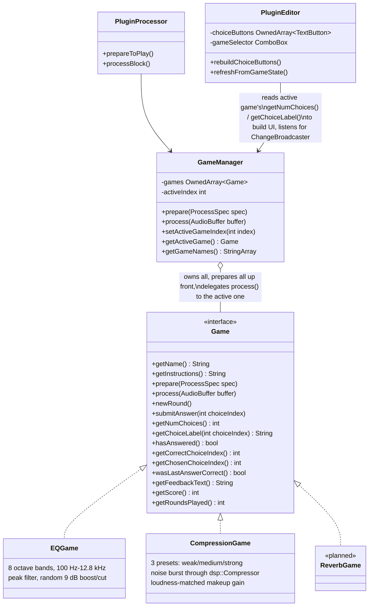

# EarTrainer game engine

Every exercise implements one interface, so `GameManager` and
`PluginEditor` never need per-game special cases. See
[decisions/001-game-interface.md](../decisions/001-game-interface.md) for
why this shape was chosen over a per-game editor.

**Why `GameManager` prepares every game up front:** switching the active
game (via the editor's `ComboBox`) then never needs an audio-thread
re-prepare — every registered `Game` is always ready, regardless of which
one is currently selected.
