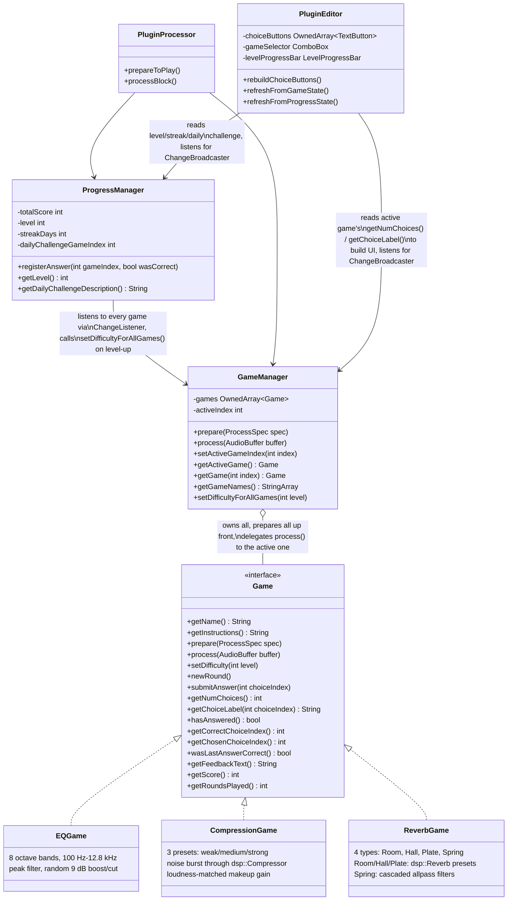

# EarTrainer game engine

Every exercise implements one interface, so `GameManager` and
`PluginEditor` never need per-game special cases. See
[decisions/001-game-interface.md](../decisions/001-game-interface.md) for
why this shape was chosen over a per-game editor, and
[decisions/002-difficulty-scaling.md](../decisions/002-difficulty-scaling.md)
for why `setDifficulty(int)` was added and how `ProgressManager` drives it.

**Why `GameManager` prepares every game up front:** switching the active
game (via the editor's `ComboBox`) then never needs an audio-thread
re-prepare — every registered `Game` is always ready, regardless of which
one is currently selected.

**Why `ProgressManager` calls `registerAnswer` instead of always going
through the `ChangeListener` chain:** `Game::sendChangeMessage()` is
asynchronous (needs a running JUCE message loop to deliver) — fine in the
real plugin, but `EarTrainerTests` never runs one, so
`ProgressManagerTest` drives `registerAnswer` directly instead. See
[testing-strategy.md](../testing-strategy.md).
