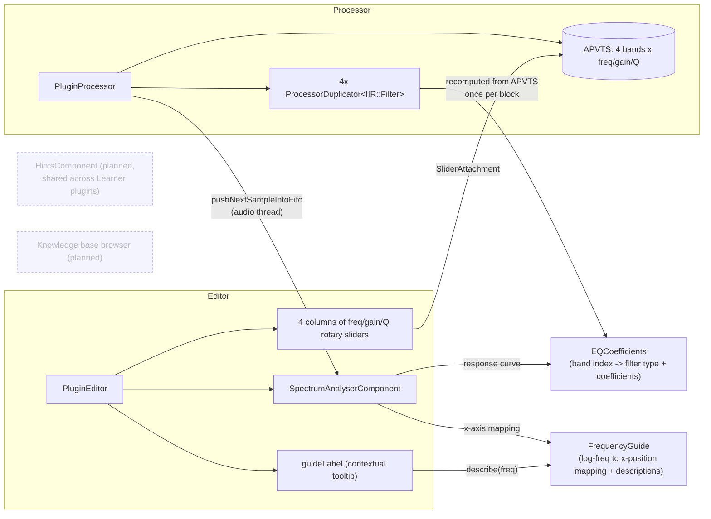

# Learner-series teaching plugins

`LearnerEQ` is the first (and so far only) plugin in this pattern —
unlike EarTrainer's games, it processes the host's real audio and is a
genuinely usable, host-automatable effect. Any future teaching plugin
(`LearnerComp`, `LearnerVerb`, ...) would follow the same shape: its own
`juce_add_plugin` target, `AudioProcessorValueTreeState` for parameters, a
visualization component, and a short contextual guide string per control.

**Why `EQCoefficients` and `FrequencyGuide` are separate headers, shared by
both processor and editor:** the processor uses `EQCoefficients::make` for
real-time filtering; the editor uses the exact same function purely to
draw the response curve. If they used different logic to decide "what does
band N sound like," the displayed curve could silently disagree with the
actual audio — sharing one source of truth rules that out. Same reasoning
for `FrequencyGuide`: the live spectrum, the response curve, and the
highlighted-band overlay all convert frequency to x-position through the
same function, so they're guaranteed to line up on screen.
