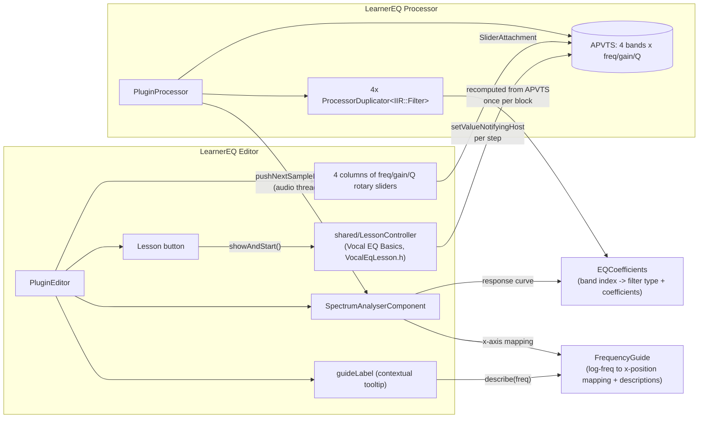
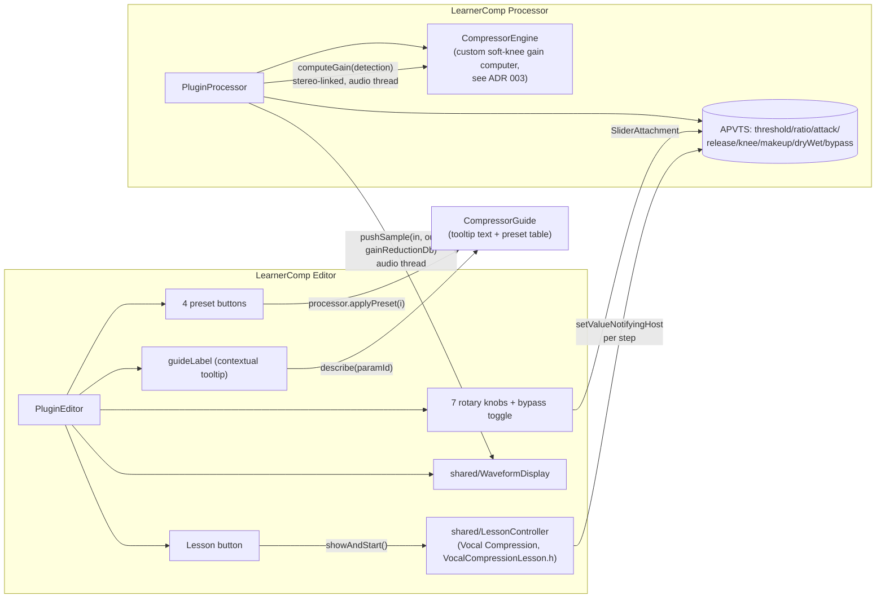
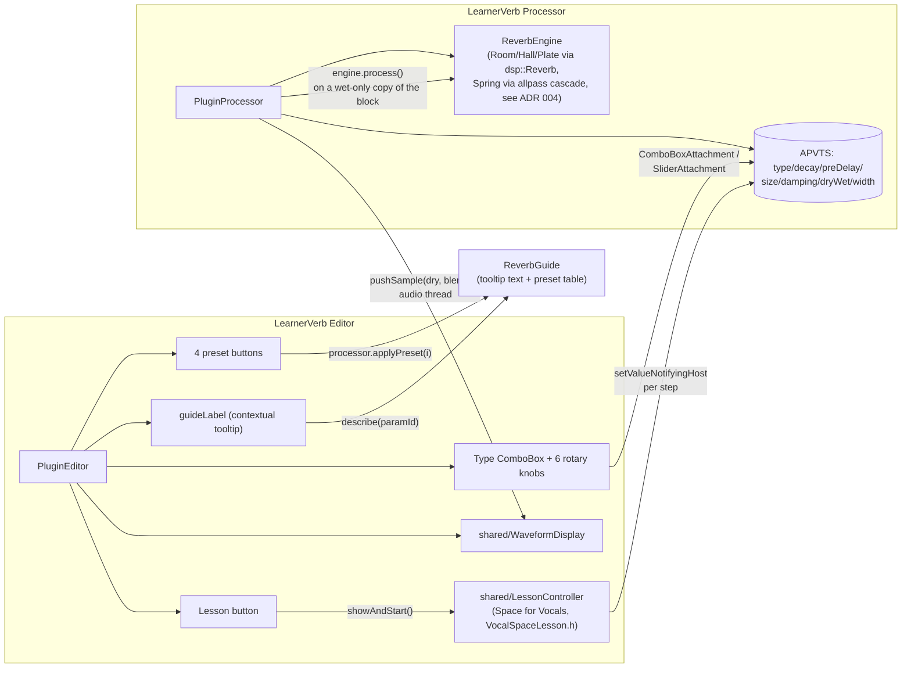

# Learner-series teaching plugins

Three plugins in this pattern so far: `LearnerEQ`, `LearnerComp`, and
`LearnerVerb`. All process the host's real audio and are genuinely
usable, host-automatable effects (unlike EarTrainer's games). All follow
the same shape: their own `juce_add_plugin` target, `AudioProcessorValueTreeState`
for parameters, a visualization component fed from the audio thread, and
a short contextual guide string per control.

## LearnerEQ

**Why `EQCoefficients` and `FrequencyGuide` are separate headers, shared by
both processor and editor:** the processor uses `EQCoefficients::make` for
real-time filtering; the editor uses the exact same function purely to
draw the response curve. If they used different logic to decide "what does
band N sound like," the displayed curve could silently disagree with the
actual audio — sharing one source of truth rules that out. Same reasoning
for `FrequencyGuide`: the live spectrum, the response curve, and the
highlighted-band overlay all convert frequency to x-position through the
same function, so they're guaranteed to line up on screen.

`SpectrumAnalyserComponent` is FFT-based and stays local to LearnerEQ —
see the shared-code note at the bottom for why it isn't unified with the
other two plugins' waveform view.

## LearnerComp

**Why detection and gain application are separate steps in
`CompressorEngine`:** `computeGain(detectionSample)` takes one value (the
loudest of the input channels at that sample) and returns a gain factor;
`PluginProcessor` applies that *same* gain to every channel. This is
stereo-linked detection — it's what keeps compression from pumping the
stereo image the way independent per-channel compression can.

**Why `applyPreset` lives on the processor, not just as an editor button
handler:** it's directly unit-testable that way (`LearnerCompTest.cpp`
calls it without needing to construct an editor/GUI at all) — see
[testing-strategy.md](../testing-strategy.md) for why constructing a
`Component` in the console test binary was avoided rather than relied on.
Same reasoning applies to `LearnerVerbProcessor::applyPreset` below.

## LearnerVerb

**Why `PluginProcessor` makes a wet-only copy of the block instead of
processing in place:** `ReverbEngine::process` always renders 100% wet,
same division of responsibility as `CompressorEngine` — the processor
blends dry/wet itself afterward, sample by sample, so `ReverbEngine` never
needs to know about the `Dry/Wet` parameter at all.

**Why `WaveformDisplay`'s highlight channel goes unused here:**
LearnerComp tints the output trace red by gain reduction; LearnerVerb has
no equivalent per-sample "how hard is this working" value, so it just
passes the default (no tint). The shared component tolerates a consumer
that doesn't need the highlight feature.

## Shared code

`shared/WaveformDisplay.{h,cpp}` — the scrolling peak-based dual-waveform
component — is used by both LearnerComp and LearnerVerb. It started as
LearnerComp-only; once LearnerVerb needed the identical FIFO-accumulate/
30 Hz-timer/scrolling-columns shape, it was extracted rather than copied a
second time (see [decisions/004](../decisions/004-learnerverb-scope.md)).
`SpectrumAnalyserComponent` (LearnerEQ) is *not* part of this — it's
FFT-based, a fundamentally different data shape from time-domain peak
tracking, so there's nothing to unify there.

`shared/MicroLesson.h` + `shared/LessonController.{h,cpp}` — the guided-
lesson machinery used by all three editors above, one lesson each. See
[decisions/005](../decisions/005-microlesson-architecture.md).
`MicroLesson` is pure step-sequence data/state with no APVTS or UI
dependency; `LessonController` is the `Component` that owns one, applies
each step's target parameters via `setValueNotifyingHost` (same idiom as
`applyPreset` above), and is added as a full-size hidden child toggled by
each editor's "Lesson" button. The lesson *content* itself
(`VocalEqLesson.h`, `VocalCompressionLesson.h`, `VocalSpaceLesson.h`)
stays per-plugin, not in `shared/`, since it references that plugin's own
parameter IDs — only the machinery above is shared.
