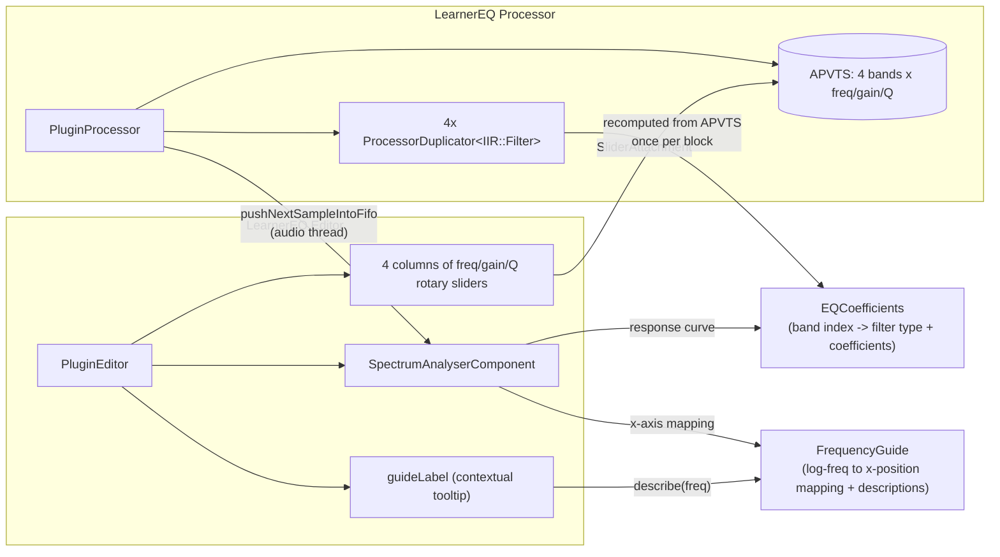
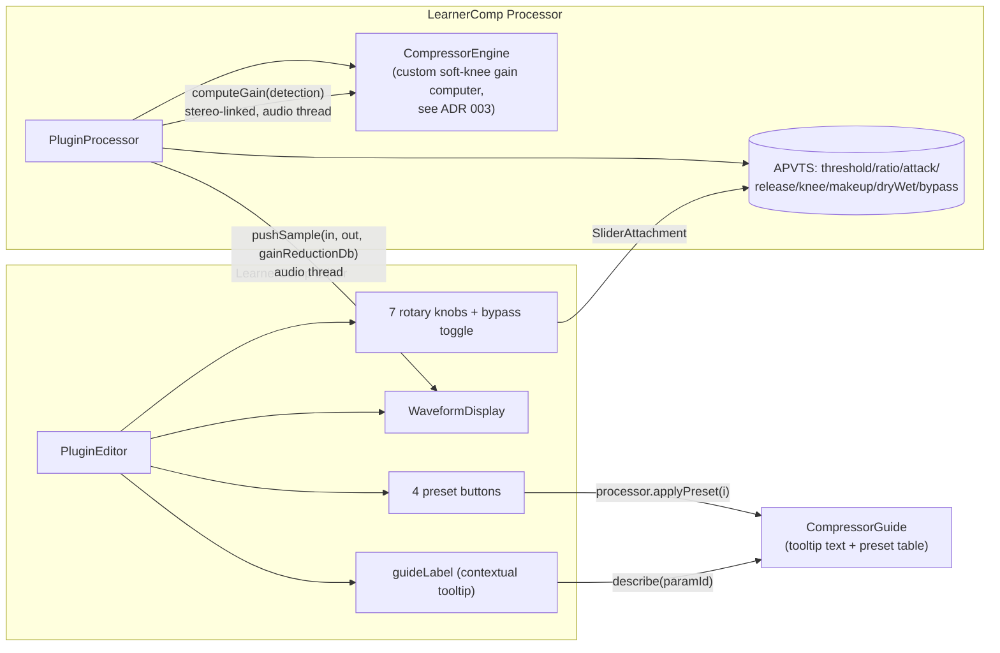

# Learner-series teaching plugins

Two plugins in this pattern so far: `LearnerEQ` and `LearnerComp`. Both
process the host's real audio and are genuinely usable, host-automatable
effects (unlike EarTrainer's games). Both follow the same shape: their own
`juce_add_plugin` target, `AudioProcessorValueTreeState` for parameters, a
visualization component fed from the audio thread, and a short contextual
guide string per control. **They don't share code with each other yet**
(see the note at the bottom) — `SpectrumAnalyserComponent` and
`WaveformDisplay` are separate, parallel implementations of the same
FIFO-fill/timer-repaint pattern.

## LearnerEQ

**Why `EQCoefficients` and `FrequencyGuide` are separate headers, shared by
both processor and editor:** the processor uses `EQCoefficients::make` for
real-time filtering; the editor uses the exact same function purely to
draw the response curve. If they used different logic to decide "what does
band N sound like," the displayed curve could silently disagree with the
actual audio — sharing one source of truth rules that out. Same reasoning
for `FrequencyGuide`: the live spectrum, the response curve, and the
highlighted-band overlay all convert frequency to x-position through the
same function, so they're guaranteed to line up on screen.

## LearnerComp

**Why detection and gain application are separate steps in
`CompressorEngine`:** `computeGain(detectionSample)` takes one value (the
loudest of the input channels at that sample) and returns a gain factor;
`PluginProcessor` applies that *same* gain to every channel. This is
stereo-linked detection — it's what keeps compression from pumping the
stereo image the way independent per-channel compression can.

**Why `applyPreset` lives on the processor, not just as an editor button
handler:** it's directly unit-testable that way (`LearnerCompTest.cpp`
calls it without needing to construct an editor/GUI at all) — see
[testing-strategy.md](../testing-strategy.md) for why constructing a
`Component` in the console test binary was avoided rather than relied on.

## Shared-code gap

`SpectrumAnalyserComponent` (LearnerEQ) and `WaveformDisplay` (LearnerComp)
are both "accumulate from the audio thread into a fixed-size buffer, flush
on a UI timer, repaint" — structurally the same pattern, implemented twice.
Nothing has been extracted into a shared component yet. Worth doing once a
third Learner plugin needs the same shape, rather than guessing the right
abstraction from two data points.
