# System overview

What's actually built (`EarTrainer`, `LearnerEQ`, `LearnerComp`,
`LearnerVerb`, `shared/`, `EarTrainerTests`) plus where the next teaching
plugins/games would plug in. Dashed boxes are **not built yet** — see
[../roadmap.md](../roadmap.md) for status.

```mermaid
flowchart TB
    subgraph EarTrainer["EarTrainer plugin (VST3 / AU / Standalone)"]
        ETProc["PluginProcessor"]
        ETEdit["PluginEditor (generic)"]
        GM["GameManager"]
        PM["ProgressManager"]
        GameIface["Game interface"]
        EQGame["EQGame"]
        CompGame["CompressionGame"]
        RevGame["ReverbGame"]
        Pink["PinkNoiseGenerator"]

        ETProc --> GM
        ETProc --> PM
        ETEdit --> GM
        ETEdit --> PM
        PM --> GM
        GM --> GameIface
        GameIface --> EQGame
        GameIface --> CompGame
        GameIface --> RevGame
        EQGame --> Pink
        CompGame --> Pink
        RevGame --> Pink
    end

    subgraph LearnerEQ["LearnerEQ plugin (VST3 / AU / Standalone)"]
        LEProc["PluginProcessor"]
        LEEdit["PluginEditor"]
        Spectrum["SpectrumAnalyserComponent"]
        Coeffs["EQCoefficients"]
        FreqGuide["FrequencyGuide"]
        APVTS[("AudioProcessorValueTreeState")]

        LEProc --> APVTS
        LEProc --> Coeffs
        LEEdit --> APVTS
        LEEdit --> Spectrum
        LEEdit --> FreqGuide
        Spectrum --> Coeffs
        Spectrum --> FreqGuide
    end

    subgraph LearnerComp["LearnerComp plugin (VST3 / AU / Standalone)"]
        LCProc["PluginProcessor"]
        LCEdit["PluginEditor"]
        Engine["CompressorEngine"]
        Guide["CompressorGuide"]

        LCProc --> Engine
        LCEdit --> Guide
    end

    subgraph LearnerVerb["LearnerVerb plugin (VST3 / AU / Standalone)"]
        LVProc["PluginProcessor"]
        LVEdit["PluginEditor"]
        RevEngine["ReverbEngine"]
        RevGuide["ReverbGuide"]

        LVProc --> RevEngine
        LVEdit --> RevGuide
    end

    subgraph Shared["shared/"]
        Waveform["WaveformDisplay"]
        TestUtils["TestUtils.h"]
    end

    subgraph Tests["EarTrainerTests (console app)"]
        Runner["TestRunner (juce::UnitTestRunner)"]
    end

    LearnerSat["LearnerSat plugin"]

    LCEdit --> Waveform
    LVEdit --> Waveform

    Runner -. "compiles & runs directly, no host/GUI" .-> EQGame
    Runner -. "compiles & runs directly" .-> CompGame
    Runner -. "compiles & runs directly" .-> RevGame
    Runner -. "compiles & runs directly" .-> GM
    Runner -. "compiles & runs directly" .-> LEProc
    Runner -. "compiles & runs directly" .-> LCProc
    Runner -. "compiles & runs directly" .-> LVProc
    Runner --> TestUtils

    LVProc -.-> LearnerSat

    classDef planned stroke-dasharray:4 3,opacity:0.55;
    class LearnerSat planned;
```

**Key structural fact:** `EarTrainerTests` links the game/processor `.cpp`
files directly rather than depending on the plugin targets. It excludes
`Source/PluginProcessor.cpp` (EarTrainer's) entirely, and excludes every
plugin's `PluginEntry.cpp` (the file containing just `createPluginFilter()`)
— LearnerEQ's, LearnerComp's, and LearnerVerb's `PluginProcessor.cpp` are
all linked in (each `*Test.cpp` needs the real processor), but their
`createPluginFilter()` factory functions live in separate files
specifically so linking three processors into one test binary doesn't
collide three definitions of that function.
