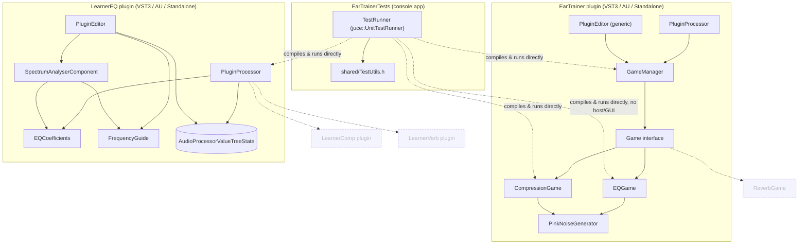

# System overview

What's actually built (`EarTrainer`, `LearnerEQ`, `shared/`, `EarTrainerTests`)
plus where the next teaching plugins/games would plug in. Dashed boxes are
**not built yet** — see [../roadmap.md](../roadmap.md) for status.

**Key structural fact:** `EarTrainerTests` links the game/processor `.cpp`
files directly rather than depending on the plugin targets. It deliberately
excludes `Source/PluginProcessor.cpp` (EarTrainer's) because both it and
`LearnerEQ/Source/PluginProcessor.cpp` define `createPluginFilter()` — linking
both into one binary would collide.
